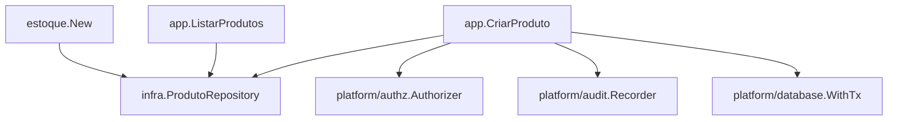

# Produtos (SKU de Estoque) Design

**Spec**: `.specs/features/estoque/spec/01-produtos.md`
**Status**: Approved

---

## Architecture Overview

Mesmo esqueleto de pacotes já consolidado em `identity`/`financeiro` (`AD-014`): `domain` (entidade+erros), `app` (um caso de uso por arquivo), `infra` (repositório concreto sobre GORM), `http` (vazio até `05-api-http`). `estoque/module.go` nasce nesta sub-spec com `estoque.New(Deps) *Module`, só com os 2 casos de uso desta sub-spec — crescerá a cada sub-spec seguinte, mesmo padrão de `financeiro.Module`.



---

## Code Reuse Analysis

### Existing Components to Leverage

| Component | Location | How to Use |
| --- | --- | --- |
| `platform/authz.Authorizer`/`Permission`/`Principal` | `api/internal/platform/authz/` | `CriarProduto`/`ListarProdutos` chamam `Authz.Require` exatamente como `financeiro/app`'s casos de uso. |
| `platform/audit.Recorder`/`Entry`/`Action`/`Register` | `api/internal/platform/audit/` | `CriarProduto` audita `produto.create` (`dominio.verbo`, mesmo formato de `conta.create`). `ListarProdutos` nunca audita (é leitura pura, mesmo padrão de `ListarContas`). |
| `platform/database.WithTx` | `api/internal/platform/database/` | `CriarProduto.Tx` — persistir+auditar na mesma transação. |
| `golang-migrate` (`api/migrations/`) | `api/migrations/000001`-`000007` | `estoque` começa em `000008_estoque_produtos.{up,down}.sql`. |
| `identity/infra`'s padrão de repositório (GORM puro, sem ORM de relação) | `api/internal/identity/infra/user_repository.go` | Modelo direto para `infra.ProdutoRepository`. |

### Integration Points

| System | Integration Method |
| --- | --- |
| `02-movimentacoes` | Lê `produtos_estoque` via uma porta de leitura (`ProdutoReader`, análoga a `financeiro/app.ContaReader`) — nunca escreve. |
| Banco (Postgres) | Nova migration `000008_estoque_produtos`. |

---

## Components

### `estoque/domain.Produto`

- **Purpose**: entidade mínima do SKU de estoque — código, nome, unidade de medida, nada comercial.
- **Location**: `api/internal/estoque/domain/produto.go`
- **Interfaces**: struct `Produto{ID, Codigo, Nome, UnidadeMedida string; CriadoEm time.Time}` — sem `Ativo`, sem `AtualizadoEm` (nunca editado, `EST-D-007`).
- **Dependencies**: nenhuma.
- **Reuses**: mesmo formato de `financeiro/domain.Conta` (campos simples, sem métodos de comportamento).

Sentinels:

```go
ErrProdutoNaoEncontrado = errors.New("produto não encontrado")
ErrCodigoDuplicado      = errors.New("código já utilizado")
```

### `app.CriarProduto`

- **Purpose**: implementa PRD-01 — cria o SKU, validando unicidade de `codigo`.
- **Location**: `api/internal/estoque/app/criar_produto.go`
- **Interfaces**: `CriarProdutoInput{Actor authz.Principal; Codigo, Nome, UnidadeMedida string}`; `Execute(ctx, in) (domain.Produto, error)`.
- **Dependencies**: `Authz Authorizer`, `Produtos ProdutoCreator` (porta: `Criar(ctx, p) (domain.Produto, error)`), `Audit Auditor`, `Tx TxFunc`.
- **Reuses**: template de `financeiro/app.CriarConta` (permissão→validação→transação{persistir+auditar}).

```go
const PermProdutoCreate authz.Permission = "estoque:produto:create"
const ActionProdutoCreate audit.Action = "produto.create"
```

Validação de campo vazio (`codigo`/`nome`/`unidade_medida`) ocorre em `Execute`, antes de `Authz.Require`? **Não** — segue a ordem já padronizada em `financeiro`: permissão primeiro, depois validação de negócio, para nunca revelar detalhe de validação a quem não tem a permissão.

Unicidade de `codigo`: garantida pela constraint `UNIQUE` da migration — o repositório traduz a violação de constraint em `domain.ErrCodigoDuplicado` (mesmo padrão que `identity/infra.UserRepository` já faz para e-mail duplicado).

### `app.ListarProdutos`

- **Purpose**: implementa PRD-02 — lista todos os SKUs, sem paginação.
- **Location**: `api/internal/estoque/app/listar_produtos.go`
- **Interfaces**: `ListarProdutosInput{Actor authz.Principal}`; `Execute(ctx, in) ([]domain.Produto, error)`.
- **Dependencies**: `Authz Authorizer`, `Produtos ProdutoLister` (porta: `Listar(ctx) ([]domain.Produto, error)`).
- **Reuses**: template de `financeiro/app.ListarContas` (consulta pura, sem `Tx`/`Audit`).

```go
const PermProdutoRead authz.Permission = "estoque:produto:read"
```

### `infra.ProdutoRepository`

- **Purpose**: implementação concreta sobre GORM, satisfazendo `ProdutoCreator`/`ProdutoLister`/`ProdutoReader` (a última consumida por `02-movimentacoes`).
- **Location**: `api/internal/estoque/infra/produto_repository.go`
- **Interfaces**: `Criar(ctx, p) (domain.Produto, error)`; `Listar(ctx) ([]domain.Produto, error)`; `Buscar(ctx, id string) (domain.Produto, error)`.
- **Dependencies**: `*gorm.DB`.
- **Reuses**: estilo de `financeiro/infra.ContaRepository` (SQL direto via GORM, sem associação de relação automática).

---

## Data Models

### Migration `000008_estoque_produtos`

```sql
CREATE TABLE produtos_estoque (
    id uuid PRIMARY KEY DEFAULT gen_random_uuid(),
    codigo text NOT NULL UNIQUE,
    nome text NOT NULL,
    unidade_medida text NOT NULL,
    criado_em timestamptz NOT NULL DEFAULT now()
);
```

Sem `ativo`, sem `atualizado_em` (`EST-D-007`: SKU é estável após a criação, nunca editado). Nome da tabela `produtos_estoque`, não `produtos` (`EST-D-011`: evita colisão futura com um catálogo comercial de `loja`).

---

## Error Handling Strategy

| Error Scenario | Handling | User Impact |
| --- | --- | --- |
| `codigo` duplicado | `infra` traduz a violação de `UNIQUE` em `domain.ErrCodigoDuplicado` | `05-api-http` mapeia para `409 codigo_duplicado` |
| campo vazio | validação em `app`, erro de validação simples (ver tasks) | `05-api-http` mapeia para `422` |
| sem permissão | `authz.ErrForbidden` | `05-api-http` mapeia para `403 forbidden` |

---

## Risks & Concerns

| Concern | Location | Impact | Mitigation |
| --- | --- | --- | --- |
| Nenhum teste de carga para unicidade de `codigo` sob alta concorrência | `infra/produto_repository.go` (a criar) | Baixo — `UNIQUE` do Postgres já garante atomicidade; um teste de integração com duas criações concorrentes do mesmo código é suficiente, sem precisar de teste de carga. | Task de `02-movimentacoes`/`03` já exige teste de concorrência real para saldo; o mesmo padrão (2 goroutines, 1 Postgres real) cobre este caso em `01` também. |

> Nenhum outro risco relevante encontrado nesta sub-spec — é a mais simples das 5.

---

## Tech Decisions

| Decision | Choice | Rationale |
| --- | --- | --- |
| Tradução de erro de `UNIQUE` para sentinel de domínio | No `infra`, não no `app` | Mesmo padrão já usado por `identity/infra` para e-mail duplicado — o `app` nunca inspeciona código de erro de driver. |

---

## Tips

Nada a adicionar — segue integralmente o padrão de `financeiro/01-plano-de-contas`.
