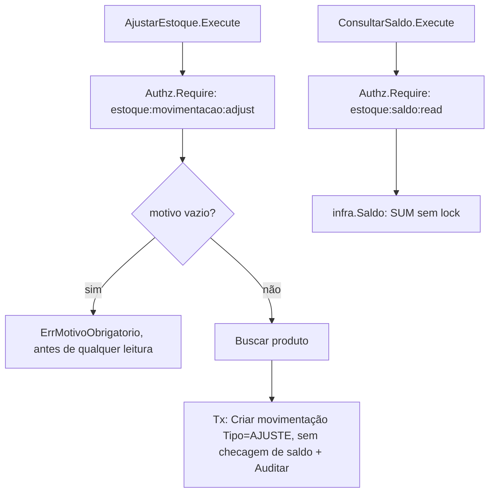

# Ajustes e Saldo Design

**Spec**: `.specs/features/estoque/spec/03-ajustes-e-saldo.md`
**Status**: Approved

---

## Architecture Overview

`AjustarEstoque` nunca usa o lock de `02-movimentacoes` (`SaldoComLock`) — é a válvula de escape explicitamente isenta da checagem de saldo negativo (regra já fechada pelo mantenedor). `ConsultarSaldo` é uma consulta pura, mesmo template de `financeiro/app.ConsultarSaldo`.



---

## Code Reuse Analysis

### Existing Components to Leverage

| Component | Location | How to Use |
| --- | --- | --- |
| `financeiro/app.CancelarLancamento`'s ordem de validação (permissão → motivo → busca → transação) | `api/internal/financeiro/app/cancelar_lancamento.go` | Modelo direto para `AjustarEstoque.Execute` — motivo obrigatório checado antes de qualquer leitura/escrita. |
| `financeiro/app.ConsultarSaldo` | `api/internal/financeiro/app/consultar_saldo.go` | Modelo direto para `estoque/app.ConsultarSaldo` — consulta pura, sem `Tx`/`Audit`. |
| `platform/audit`'s `requiresReason()` | `api/internal/platform/audit/` | Reforça automaticamente que uma ação terminada em `.adjust` carrega `Reason` não vazio — mesma garantia que `financeiro` já tem para `.cancel`. |

### Integration Points

| System | Integration Method |
| --- | --- |
| `02-movimentacoes` | Escreve na mesma tabela `movimentacoes_estoque` (`Tipo=AJUSTE`), através da mesma `infra.MovimentacaoRepository`, mas com uma porta própria (sem a checagem de saldo). |
| Banco (Postgres) | Nenhuma migration nova — reaproveita `movimentacoes_estoque` de `02`. |

---

## Components

### `app.AjustarEstoque`

- **Purpose**: implementa AJS-01 — registra `Tipo=AJUSTE` com motivo obrigatório, sem checagem de saldo negativo.
- **Location**: `api/internal/estoque/app/ajustar_estoque.go`
- **Interfaces**:

```go
type AjustarEstoqueInput struct {
    Actor     authz.Principal
    ProdutoID string
    Quantidade int64 // sinal livre, nunca zero
    Motivo    string
}
func (a *AjustarEstoque) Execute(ctx, in AjustarEstoqueInput) (domain.Movimentacao, error)
```

- **Dependencies**: `Authz Authorizer`, `Produtos ProdutoReader`, `Movimentacoes MovimentacaoCreator` (porta estreita: só `Criar`, sem `SaldoComLock` — a ausência do método na interface já é a garantia estrutural de que este caso de uso não pode checar saldo por engano), `Audit Auditor`, `Tx TxFunc`.
- **Reuses**: ordem de `financeiro/app.CancelarLancamento.Execute`.

```go
const PermMovimentacaoAdjust authz.Permission = "estoque:movimentacao:adjust"
const ActionMovimentacaoAdjust audit.Action = "movimentacao.adjust"

func (a *AjustarEstoque) Execute(ctx context.Context, in AjustarEstoqueInput) (domain.Movimentacao, error) {
    if err := a.Authz.Require(ctx, in.Actor, PermMovimentacaoAdjust); err != nil {
        return domain.Movimentacao{}, err
    }
    if in.Quantidade == 0 {
        return domain.Movimentacao{}, domain.ErrQuantidadeInvalida
    }
    if motivoBlank(in.Motivo) { // mesmo helper de financeiro/app, reaproveitado por cópia (pacotes distintos)
        return domain.Movimentacao{}, domain.ErrMotivoObrigatorio
    }
    if _, err := a.Produtos.Buscar(ctx, in.ProdutoID); err != nil {
        return domain.Movimentacao{}, err
    }
    var criada domain.Movimentacao
    err := a.Tx(ctx, func(ctx context.Context) error {
        var err error
        motivo := in.Motivo
        criada, err = a.Movimentacoes.Criar(ctx, domain.Movimentacao{
            ProdutoID: in.ProdutoID, Tipo: domain.Ajuste, Quantidade: in.Quantidade,
            Origem: domain.OrigemAjusteManual, Motivo: &motivo, ResponsavelID: in.Actor.UserID,
        })
        if err != nil { return err }
        return a.Audit.Record(ctx, audit.Entry{
            ActorType: audit.ActorUser, ActorID: in.Actor.UserID, Action: ActionMovimentacaoAdjust,
            EntityType: "movimentacao_estoque", EntityID: criada.ID, Outcome: audit.OutcomeSuccess,
            Reason: in.Motivo,
        })
    })
    return criada, err
}
```

### `app.ConsultarSaldo`

- **Purpose**: implementa AJS-02.
- **Location**: `api/internal/estoque/app/consultar_saldo.go`
- **Interfaces**: `ConsultarSaldoInput{Actor authz.Principal; ProdutoID string}`; `Execute(ctx, in) (int64, error)`.
- **Dependencies**: `Authz Authorizer`, `Produtos ProdutoReader`, `Movimentacoes SaldoReader` (porta: `Saldo(ctx, produtoID) (int64, error)`, sem lock).
- **Reuses**: template de `financeiro/app.ConsultarSaldo`.

```go
const PermSaldoRead authz.Permission = "estoque:saldo:read"
```

Confirma que o `produto_id` existe antes de consultar (`ProdutoReader.Buscar`) — devolve `domain.ErrProdutoNaoEncontrado` se não existir, nunca um saldo `0` enganoso para um SKU inexistente.

---

## Data Models

Nenhuma migration nova — `AjustarEstoque` escreve em `movimentacoes_estoque` (já criada em `02-movimentacoes`) com `tipo='AJUSTE'`.

---

## Error Handling Strategy

| Error Scenario | Handling | User Impact |
| --- | --- | --- |
| `motivo` vazio/ausente | `domain.ErrMotivoObrigatorio`, antes de qualquer leitura/escrita | `05-api-http` mapeia para `422 motivo_obrigatorio` |
| `quantidade == 0` | `domain.ErrQuantidadeInvalida` | `422 quantidade_invalida` |
| `produto_id` inexistente | `domain.ErrProdutoNaoEncontrado` | `404 produto_nao_encontrado` |
| soma de movimentações ultrapassaria o limite seguro de `int64` | `domain.ErrQuantidadeForaDoLimite` (novo sentinel, só nesta sub-spec) | `422` — mesma categoria de `platform/money.ErrOutOfRange`, nunca esperado na prática, mas guardado por precaução |

---

## Risks & Concerns

| Concern | Location | Impact | Mitigation |
| --- | --- | --- | --- |
| `AjustarEstoque` nunca verifica saldo — um uso indevido pode mascarar uma saída não registrada como "ajuste" | `app/ajustar_estoque.go` (a criar) | Médio, mas é exatamente o comportamento aprovado (`EST-D-010`/regras fechadas) — a mitigação é a auditoria obrigatória com motivo, não uma checagem técnica. | Nenhuma mitigação de código adicional — é uma escolha de processo/governança, fora do escopo técnico desta sub-spec. |

---

## Tech Decisions

| Decision | Choice | Rationale |
| --- | --- | --- |
| `AjustarEstoque` usa uma porta sem `SaldoComLock` | Isolamento estrutural (a interface não declara o método) | Garante, pelo próprio sistema de tipos do Go, que a checagem de saldo nunca pode ser chamada por engano em `AjustarEstoque` — mesmo espírito de `financeiro/app.ListarComprovantes` não ter `Lancamentos`/`Auditor` na struct. |

---

## Tips

`ConsultarSaldo` e a checagem interna de `RegistrarMovimentacao` usam métodos diferentes do repositório (`Saldo` vs `SaldoComLock`) de propósito — nunca unificar em um só método "por simplicidade": a consulta não deve pagar o custo (nem o risco) de um lock que não precisa.
