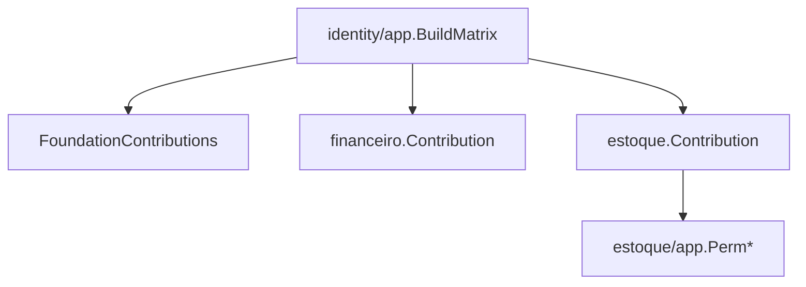

# Permissões Design

**Spec**: `.specs/features/estoque/spec/04-permissoes.md`
**Status**: Approved

---

## Architecture Overview

Mesmo padrão de `financeiro.Contribution()` (`FIN-D-017`/`FIN-D-019`): a contribuição mora no pacote raiz do módulo, referencia as constantes `Perm*` já declaradas por `estoque/app` (nunca strings literais), e é agregada por `identity/app.BuildMatrix` junto de `FoundationContributions()` e `financeiro.Contribution()`.



---

## Code Reuse Analysis

### Existing Components to Leverage

| Component | Location | How to Use |
| --- | --- | --- |
| `identity/app.BuildMatrix` | `api/internal/identity/app/roles_matrix.go` | Já aceita qualquer número de `Contribution`s — nenhuma mudança necessária nele. |
| `identity/app.Role`/`RoleEstoqueLoja` etc. (alias de `identity/domain`) | `api/internal/identity/app/roles.go` | `estoque/module.go` usa `app.Role`/`app.RoleEstoqueLoja`, nunca importa `identity/domain` diretamente — mesma restrição de `architecture_test.go` que `FIN-D-018` já resolveu para `financeiro`. |
| `forbiddenToConselhoFiscal` | `api/internal/identity/app/roles_matrix.go:27` | Não precisa de nova entrada — `estoque.Contribution()` simplesmente nunca concede `create`/`adjust` ao Conselho Fiscal; a lista só protege contra erro futuro em outro módulo que tentasse. |

### Integration Points

| System | Integration Method |
| --- | --- |
| `cmd/api/main.go`, `cmd/bootstrap-admin/main.go` | Precisarão agregar `estoque.Contribution()` junto de `financeiro.Contribution()` — mudança real de composição root, fora desta sub-spec se `estoque` ainda não tiver `estoque.New` publicado em produção (ver nota em `tasks/04-permissoes.md`). |

---

## Components

### `estoque.Contribution()`

- **Purpose**: implementa PERM-01.
- **Location**: `api/internal/estoque/module.go`
- **Interfaces**: `func Contribution() identityapp.Contribution`
- **Dependencies**: `identity/app.Role`/`RoleEstoqueLoja`/`RoleDiretoria`/`RoleConselhoFiscal` (alias), `estoque/app.Perm*`.
- **Reuses**: template de `financeiro.Contribution()`.

```go
func Contribution() app.Contribution {
    return app.Contribution{
        Module: "estoque",
        Grants: map[app.Role][]authz.Permission{
            app.RoleEstoqueLoja: {
                estoqueapp.PermProdutoCreate, estoqueapp.PermProdutoRead,
                estoqueapp.PermMovimentacaoCreate, estoqueapp.PermMovimentacaoAdjust,
                estoqueapp.PermMovimentacaoRead, estoqueapp.PermSaldoRead,
            },
            app.RoleDiretoria: {
                estoqueapp.PermProdutoRead, estoqueapp.PermMovimentacaoRead, estoqueapp.PermSaldoRead,
            },
            app.RoleConselhoFiscal: {
                estoqueapp.PermProdutoRead, estoqueapp.PermMovimentacaoRead, estoqueapp.PermSaldoRead,
            },
        },
    }
}
```

(`PRESIDENTE` nunca aparece num `Grants` — o automático-para-tudo já é um mecanismo prévio de `authz.Covers`, inalterado.)

---

## Data Models

Nenhuma — esta sub-spec não toca schema.

---

## Error Handling Strategy

Não aplicável — `Contribution()` não é um caminho de execução com erro, é só dado estático agregado no boot.

---

## Risks & Concerns

| Concern | Location | Impact | Mitigation |
| --- | --- | --- | --- |
| Primeira vez que `ESTOQUE_LOJA` ganha conteúdo real de RBAC | `estoque.Contribution()` (a criar) | Nenhum teste existente cobre esse papel com permissões reais — mesma classe de achado que `FIN-D-020` encontrou para `TESOURARIA` | Task de `04-permissoes` inclui teste de integração confirmando a matriz de produção completa (`FoundationContributions()`+`financeiro.Contribution()`+`estoque.Contribution()`), mesmo padrão do teste `TestContributionCombinedWithFoundationContributionsBuildsTheFullProductionMatrix` de `financeiro/module_test.go`. |

---

## Tech Decisions

Nenhuma decisão técnica não-óbvia — segue `financeiro/05-permissoes` literalmente.

---

## Tips

Nenhum.
