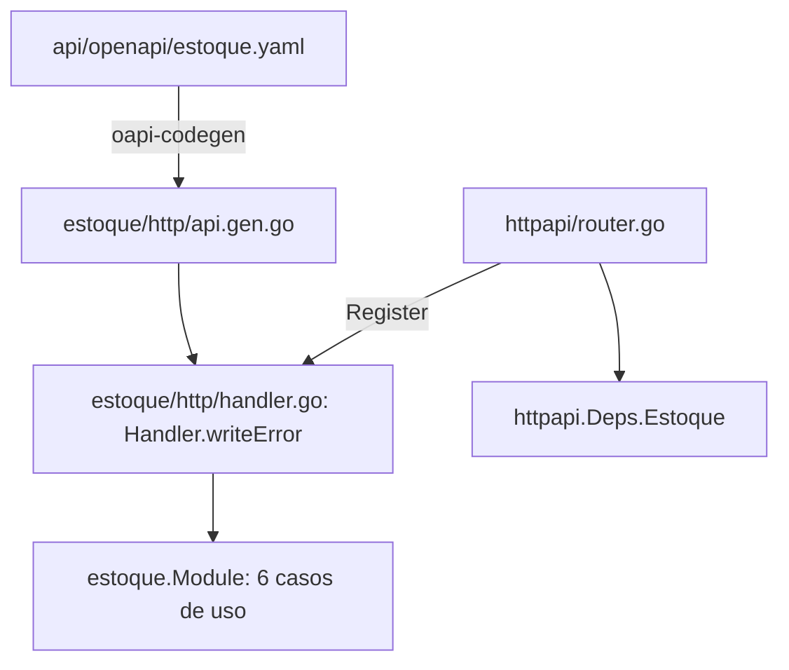

# API HTTP Design

**Spec**: `.specs/features/estoque/spec/05-api-http.md`
**Status**: Approved

---

## Architecture Overview

Réplica estrutural de `financeiro/06-api-http`: contrato OpenAPI contract-first (`api/openapi/estoque.yaml`), `oapi-codegen` (strict+gin), composition root (`estoque.New`), handlers finos, tabela explícita de erro, montagem final em `httpapi/router.go`.



---

## Code Reuse Analysis

### Existing Components to Leverage

| Component | Location | How to Use |
| --- | --- | --- |
| `financeiro.New`/`Module` (template) | `api/internal/financeiro/module.go` | Modelo direto para `estoque.New(Deps) *Module` — 2 repositórios + 6 casos de uso. |
| `financeiro/http/handler.go` (template) | `api/internal/financeiro/http/handler.go` | Modelo direto para `estoque/http/handler.go` — `sessionOf`/`ginContext`/`requestContext` copiados (mesma razão de `FIN-D-028`: pacotes não compartilham essas funções privadas). |
| `httpx.NewContractValidator`, `httpx.Authn`/`CSRF`/`BodyLimit`/`Origin` | `api/internal/platform/httpx/` | Reaproveitados sem nenhuma mudança — `estoque` não precisa de upload (sem `FIN-D-024`-equivalente; nenhuma rota multipart nesta sub-spec). |
| `common.yaml` (`Problem`, `FieldError`, respostas comuns, `CsrfToken`) | `api/openapi/common.yaml` | Reaproveitado sem nenhum schema novo para esses conceitos — mesma disciplina de `identity.yaml`/`financeiro.yaml`. |
| `httpapi/router.go`'s `parity`/`routeKeys`/`operationKeys` | `api/internal/httpapi/router.go` | Já cobre qualquer spec adicionada à lista, sem alteração de código (mesma garantia que já vale para `financeiro`). |

### Integration Points

| System | Integration Method |
| --- | --- |
| `httpapi.Deps` | Ganha o campo `Estoque *estoque.Module` — a trajetória mecânica (campo inerte até a rota ser registrada) é a mesma de `FIN-D-025`; **só é necessária se a sub-spec de wiring final não conseguir registrar tudo numa única tarefa** — a ser decidido em `tasks/05-api-http.md` à luz do número de tarefas (ver nota na seção de Tasks do arquivo de tasks). |
| `web/redocly.yaml` | Nova entrada `estoque@v1`, mesmo padrão de `financeiro@v1`. |

---

## Components

### Contrato `api/openapi/estoque.yaml`

6 operações:

| Operação | Método + caminho | Permissão | Corpo/Resposta |
| --- | --- | --- | --- |
| `CreateProduto` | `POST /api/v1/estoque/produtos` | `estoque:produto:create` | `{codigo, nome, unidade_medida}` → `201 Produto` |
| `ListProdutos` | `GET /api/v1/estoque/produtos` | `estoque:produto:read` | → `200 ProdutoList` |
| `CreateMovimentacao` | `POST /api/v1/estoque/movimentacoes` | `estoque:movimentacao:create` | `{tipo, produto_id, quantidade, origem, movimentacao_de_id?}` → `201 Movimentacao` |
| `ListMovimentacoes` | `GET /api/v1/estoque/produtos/{id}/movimentacoes` | `estoque:movimentacao:read` | → `200 MovimentacaoList` |
| `CreateAjuste` | `POST /api/v1/estoque/ajustes` | `estoque:movimentacao:adjust` | `{produto_id, quantidade, motivo}` → `201 Movimentacao` |
| `GetSaldo` | `GET /api/v1/estoque/produtos/{id}/saldo` | `estoque:saldo:read` | → `200 Saldo {saldo}` |

`movimentacao_de_id` é **opcional no schema** (nunca `oneOf`/discriminador de union — nenhum precedente disso em `identity.yaml`/`financeiro.yaml`, e `oapi-codegen` em modo strict lida mal com union types); a obrigatoriedade condicional (presente ⟺ `tipo=DEVOLUCAO`) é validada na camada de aplicação (`RegistrarMovimentacao.Execute`), devolvendo `devolucao_invalida` quando ausente para `tipo=DEVOLUCAO` — mesma disciplina de `financeiro` (contrato descreve forma, não toda regra de negócio).

### `estoque/http.Handler`

- **Purpose**: implementa `StrictServerInterface` sobre `estoque.Module` — thin, delega tudo.
- **Location**: `api/internal/estoque/http/handler.go`
- **Interfaces**: `Handler{M *estoque.Module, Log *slog.Logger}`, `New(m, log) *Handler`, `writeError(c, err)`.
- **Dependencies**: `estoque.Module`.
- **Reuses**: `financeiro/http/handler.go` como modelo direto — tabela de `sentinels` com status+code explícitos (nenhum `.Error()` de `estoque/domain` usado como code, mesmo motivo de `FIN-D-022`: são frases em português).

Tabela de erro completa (API-04):

```
domain.ErrProdutoNaoEncontrado       → 404  produto_nao_encontrado
domain.ErrCodigoDuplicado            → 409  codigo_duplicado
domain.ErrDevolucaoInvalida          → 422  devolucao_invalida
domain.ErrSaldoInsuficiente          → 409  saldo_insuficiente
domain.ErrQuantidadeInvalida         → 422  quantidade_invalida
domain.ErrMotivoObrigatorio          → 422  motivo_obrigatorio
authz.ErrForbidden                   → 403  forbidden
domain.ErrCampoObrigatorio           → 422  validation_failed   (transversal, EST-D-013 — fora dos 7 de EST-D-006)
database.Unavailable(err)            → 503  service_unavailable
audit.ErrWrite                       → 500  audit_failed
default                              → 500  internal_error
```

(`domain.ErrMovimentacaoNaoEncontrada` nunca chega à camada HTTP — `RegistrarMovimentacao.Execute` já a traduz para `ErrDevolucaoInvalida` antes de retornar, mesmo padrão que `financeiro/app.CriarDevolucao` já aplica para `ErrLancamentoNaoEncontrado`→`ErrDevolucaoInvalida`.)

(`domain.ErrCampoObrigatorio` — `EST-D-013`, decidida pelo mantenedor em 2026-10-04: esse sentinel só existe desde `01-produtos/T4`, depois desta sub-spec já ter sido desenhada. `CreateProdutoRequest.codigo`/`nome`/`unidade_medida` mantêm `minLength: 1` no contrato; um valor só com espaços passa esse `minLength` mas é recusado pelo caso de uso. Ele responde o erro **transversal** `422 validation_failed` — o mesmo que o contrato já devolve para string vazia e o único 422 documentado para `createProduto` —, nunca um code novo: a tabela de domínio continua exatamente a de `EST-D-006`.)

### `estoque.New` (composition root)

- **Purpose**: liga os 2 repositórios e os 6 casos de uso — mesmo template de `financeiro.New`.
- **Location**: `api/internal/estoque/module.go`
- **Interfaces**: `type Deps struct { DB *gorm.DB; Recorder *audit.Recorder; Authorizer *authz.Authorizer }`; `func New(d Deps) *Module`.
- **Dependencies**: nenhuma dependência de `platform/documents`/`storage` (estoque não tem upload) — mais simples que `financeiro.Deps`.
- **Reuses**: `financeiro.New` como modelo.

---

## Data Models

Nenhum novo — reaproveita `produtos_estoque`/`movimentacoes_estoque` de `01`/`02`.

---

## Error Handling Strategy

Ver tabela de erro completa acima (API-04). Mesmo formato `problem+json` de todos os outros módulos (`httpx.WriteProblem`), sem nenhuma estrutura nova.

---

## Risks & Concerns

| Concern | Location | Impact | Mitigation |
| --- | --- | --- | --- |
| Mesma restrição do Go que `financeiro/06-api-http` encontrou (`FIN-D-026`/`FIN-D-027`/`FIN-D-029`): uma interface não pode ser satisfeita parcialmente | `estoque/http/*.go` (a criar) | Se a decomposição em tasks seguir o mesmo padrão task-por-recurso de `financeiro`, os mesmos achados mecânicos (harness manual de teste, `Register` sem rotas até a última tarefa, `httpapi/routes_test.go` vermelho entre tarefas) se repetirão. | `tasks/05-api-http.md` já nasce com isso em mente — ver nota na seção de Tasks: dado que `estoque` tem só 6 operações (vs. 15 de `financeiro`), a decomposição pode caber numa única tarefa de handlers + uma de wiring, evitando a maior parte da ginástica de `FIN-D-029` (harness manual) que só se justificou em `financeiro` pelo volume de 4 tarefas de handler. |

---

## Tech Decisions

| Decision | Choice | Rationale |
| --- | --- | --- |
| `movimentacao_de_id` condicional | Validado na aplicação, nunca `oneOf` no contrato | Sem precedente de union type em nenhum contrato existente; mantém o contrato no mesmo estilo simples já consolidado. |
| Número de tarefas de handler | Uma única tarefa para os 6 métodos (não 3 tarefas como em `financeiro`, que tinha 15 métodos distribuídos em 4 tarefas) | Volume 2.5× menor não justifica a mesma granularidade — ver `tasks/05-api-http.md`. |

---

## Tips

Se o volume real durante a implementação mostrar que uma única tarefa de handler é grande demais, dividir por recurso (`produtos`+`movimentacoes` numa tarefa, `ajustes`+`saldo` noutra) é uma correção mecânica legítima — documentar como achado, não pedir nova aprovação de design.
