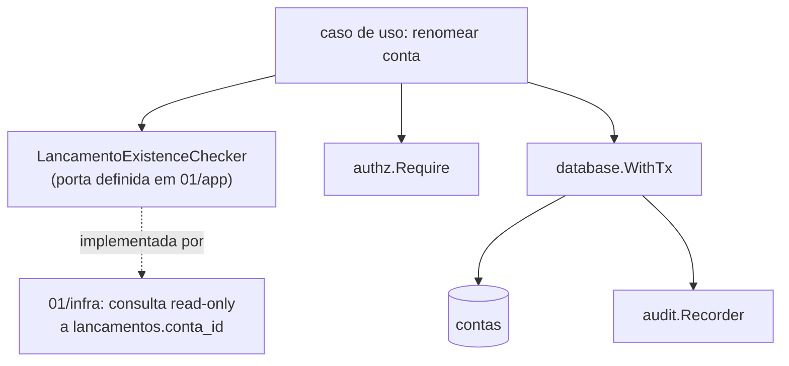

# Plano de Contas — Design

**Spec**: `.specs/features/financeiro/spec/01-plano-de-contas.md`
**Status**: Approved (2026-09-29).

## Architecture Overview

`01-plano-de-contas` é a única dona de `ContaContabil`. O único ponto de acoplamento com `02-lancamentos` é a checagem de uso na renomeação (`FIN-D-008`), resolvida por uma porta de leitura definida aqui, nunca por escrita cruzada.



## Code Reuse Analysis

| Component | Location | How to Use |
|---|---|---|
| Permissões | `platform/authz` | `Require(ctx, actor, financeiro:conta:*)` — nomes definidos em `05-permissoes` |
| Auditoria | `platform/audit` | `Record` na mesma transação de cada operação |
| Transação | `platform/database` | `WithTx` |

## Components

### `financeiro` (pacote raiz do módulo, camada `plano_de_contas`)

- **Purpose**: CRUD restrito de contas contábeis.
- **Interfaces**:
  - `CriarConta(ctx, CriarContaInput) (Conta, error)`
  - `RenomearConta(ctx, RenomearContaInput) (Conta, error)` — chama `LancamentoExistenceChecker.TemLancamento(ctx, contaID)` antes de permitir.
  - `DesativarConta(ctx, DesativarContaInput) error`
  - `ListarContas(ctx, ListarContasInput) ([]Conta, error)`
- **Porta definida aqui**: `type LancamentoExistenceChecker interface { TemLancamento(ctx context.Context, contaID uuid.UUID) (bool, error) }` — implementada em `infra` com uma consulta `SELECT EXISTS(SELECT 1 FROM lancamentos WHERE conta_id = ?)`. Vive fisicamente no mesmo módulo Go (`api/internal/financeiro/`), então não há import de um módulo de negócio para outro — só uma leitura entre duas entidades do mesmo domínio, composta em `financeiro.New`.

## Data Models

```sql
-- financeiro: plano de contas
CREATE TABLE contas_contabeis (
  id         uuid PRIMARY KEY DEFAULT gen_random_uuid(),
  tipo       text NOT NULL CHECK (tipo IN ('RECEITA', 'DESPESA')),
  nome       text NOT NULL,
  parent_id  uuid REFERENCES contas_contabeis,
  ativo      boolean NOT NULL DEFAULT true,
  created_at timestamptz NOT NULL DEFAULT now()
);
CREATE INDEX contas_contabeis_parent_idx ON contas_contabeis (parent_id);
-- GRANT INSERT, SELECT, UPDATE ON contas_contabeis TO tj_app (sem DELETE)
```

`UPDATE` é concedido (nome e `ativo` mudam), mas nunca `DELETE` — mesmo padrão de imutabilidade parcial já usado em `documents` (que nem `UPDATE` concede, porque nada nele muda depois de criado; aqui, dois campos mudam sob regra restrita, então `UPDATE` é necessário, mas sem `DELETE`).

**Relationships**: auto-referência via `parent_id`, mesma `tipo` do pai (validado em aplicação, não em constraint de banco — uma `CHECK` entre linhas da mesma tabela exigiria um gatilho, desnecessário para uma regra que a aplicação já garante antes do INSERT). Referenciada por `lancamentos.conta_id` (dono: `02`), sem FK reversa desta tabela para lá.

## Tech Decisions (only non-obvious ones)

| Decision | Choice | Rationale |
|---|---|---|
| Checagem de uso | Porta de leitura, não flag desnormalizada nem gatilho | `FIN-D-008` — evita escrita cruzada (pior) e mantém a regra visível no código Go de `01`, não escondida em SQL |
| Mesma `tipo` do pai | Validado em aplicação | Regra simples, não justifica um `CHECK` entre linhas via gatilho |
| `UPDATE` concedido a `tj_app` | Sim, restrito à regra de negócio (aplicação decide quando aceitar) | Diferente de `documents`, aqui há campos que legitimamente mudam (nome antes do uso, `ativo`) |
