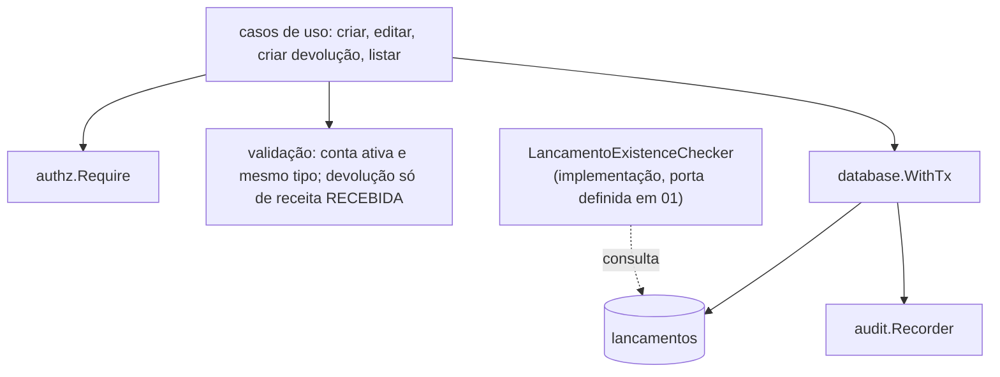

# Lançamentos — Design

**Spec**: `.specs/features/financeiro/spec/02-lancamentos.md`
**Status**: Approved (2026-09-29). Depende da migração de `01-plano-de-contas` (FK `conta_id`).

## Architecture Overview



Ordem em "criar": permissão recebida → validação de conta (existe, ativa, mesmo tipo) → se devolução, validação do lançamento referenciado → transação com o registro e a auditoria. Edição segue a mesma ordem, com a checagem adicional de `status = CRIADA` antes de qualquer validação de campo.

## Code Reuse Analysis

| Component | Location | How to Use |
|---|---|---|
| Permissões | `platform/authz` | `financeiro:lancamento:create`/`update`/`read`, definidas em `05-permissoes` |
| Auditoria | `platform/audit` | `financeiro.lancamento.create`/`update`, com before/after na edição |
| Dinheiro | `platform/money` | `Cents`, `Sub` para `valor_liquido_cents = valor_bruto_cents.Sub(taxa_cents)` |
| Transação | `platform/database` | `WithTx` |

## Data Models

```sql
-- financeiro: lançamentos
CREATE TABLE lancamentos (
  id                 uuid PRIMARY KEY DEFAULT gen_random_uuid(),
  tipo               text NOT NULL CHECK (tipo IN ('RECEITA', 'DESPESA')),
  conta_id           uuid NOT NULL REFERENCES contas_contabeis,
  valor_bruto_cents  bigint NOT NULL CHECK (valor_bruto_cents > 0),
  taxa_cents         bigint NOT NULL DEFAULT 0 CHECK (taxa_cents >= 0),
  valor_liquido_cents bigint NOT NULL,
  forma_pagamento    text NOT NULL CHECK (forma_pagamento IN ('PIX', 'CARTAO', 'DINHEIRO', 'TRANSFERENCIA', 'OUTROS')),
  status             text NOT NULL DEFAULT 'CRIADA', -- valores e transições: ver 03-workflow-e-saldo
  devolucao_de_id    uuid REFERENCES lancamentos,
  motivo_cancelamento text,
  cancelado_por      uuid REFERENCES users,
  cancelado_em       timestamptz,
  criado_por         uuid NOT NULL REFERENCES users,
  criado_em          timestamptz NOT NULL DEFAULT now(),
  atualizado_em      timestamptz NOT NULL DEFAULT now()
);
CREATE INDEX lancamentos_conta_idx ON lancamentos (conta_id);
CREATE INDEX lancamentos_devolucao_idx ON lancamentos (devolucao_de_id) WHERE devolucao_de_id IS NOT NULL;
-- GRANT INSERT, SELECT, UPDATE ON lancamentos TO tj_app (sem DELETE)
```

`status`, `motivo_cancelamento`, `cancelado_por`, `cancelado_em` são colunas desta tabela (dona: `02`), mas a **regra** de quando `status` pode mudar e de como o cancelamento é registrado é de `03-workflow-e-saldo` — ver a tabela de ownership em `financeiro/STATE.md`. Esta spec só garante que a coluna existe e nasce `CRIADA`.

**Relationships**: `conta_id` → `contas_contabeis` (dono: `01`, sem escrita reversa). `devolucao_de_id` → auto-referência nesta mesma tabela, unidirecional (`FIN-D-003`): só a despesa carrega o valor, a receita original nunca é escrita por causa disso — nenhuma coluna nesta tabela representa "sou referenciada por uma devolução".

## Tech Decisions (only non-obvious ones)

| Decision | Choice | Rationale |
|---|---|---|
| `valor_liquido_cents` | Calculado e armazenado na criação, nunca recomputado depois | Preserva o histórico mesmo se a lógica de cálculo evoluir; consistente com o padrão de imutabilidade do restante do projeto |
| `tipo` da conta vs. do lançamento | Validado em aplicação, não em constraint cruzada de banco | Mesmo racional de `01`: uma `CHECK` entre tabelas exigiria gatilho, desnecessário para uma regra simples que a aplicação garante antes do INSERT |
| Devolução usa a mesma permissão de criação | Sem `financeiro:devolucao:create` própria | `FIN-001`/`financeiro/STATE.md`: devolução é estruturalmente um lançamento comum com um campo extra, não uma operação de negócio distinta |
| Porta `LancamentoExistenceChecker` de `01` | Implementada aqui, como uma query simples contra esta mesma tabela | `FIN-D-008` — ver nota de ordem de execução em `financeiro/STATE.md`: a implementação concreta só é testável de ponta a ponta depois que esta migração existir |
