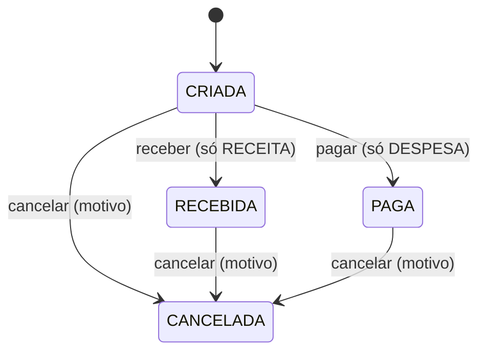

# Workflow e Saldo — Design

**Spec**: `.specs/features/financeiro/spec/03-workflow-e-saldo.md`
**Status**: Approved (2026-09-29). Opera sobre `LancamentoFinanceiro`, dona: `02-lancamentos`.

## Architecture Overview

Nenhum outro estado ou transição existe no V1. `04-comprovantes` não aparece neste diagrama — a existência de comprovante nunca é insumo de nenhuma transição (`FIN-D-005`).

Ordem em cada caso de uso: permissão recebida → checar `status` atual permite a transição → transação (`UPDATE status` + campos de cancelamento quando aplicável + auditoria).

## Code Reuse Analysis

| Component | Location | How to Use |
|---|---|---|
| Permissões | `platform/authz` | `financeiro:lancamento:receive`/`pay`/`cancel`, `financeiro:saldo:read` |
| Auditoria | `platform/audit` | Ações distintas `financeiro.lancamento.receive`/`.pay`; `.cancel` com `Reason` obrigatório, já reforçado por `platform/audit`'s `requiresReason()` no sufixo `.cancel` |
| Transação | `platform/database` | `WithTx` |
| Dinheiro | `platform/money` | soma de `Cents` para o saldo |

## Components

### `financeiro` (camada `workflow`)

- **Interfaces**:
  - `Receber(ctx, ReceberInput) (LancamentoFinanceiro, error)`
  - `Pagar(ctx, PagarInput) (LancamentoFinanceiro, error)`
  - `Cancelar(ctx, CancelarInput) (LancamentoFinanceiro, error)` — `CancelarInput` inclui `Motivo string`, validado não-vazio antes de qualquer escrita.
  - `ConsultarSaldo(ctx, ConsultarSaldoInput) (SaldoCents money.Cents, error)`
- **Dependencies**: opera sobre a mesma tabela `lancamentos` de `02-lancamentos` — sem entidade própria.

## Tech Decisions (only non-obvious ones)

| Decision | Choice | Rationale |
|---|---|---|
| Saldo | `SELECT COALESCE(SUM(...) FILTER (WHERE status='RECEBIDA'), 0) - COALESCE(SUM(...) FILTER (WHERE status='PAGA'), 0)` numa única query | Simples, correto por definição em regime de caixa (`FIN-D-001`); sem necessidade de materializar um saldo em cache no V1, dado o volume esperado |
| Cancelamento de liquidado | Sem vínculo obrigatório a um lançamento substituto | Decisão fechada na revisão arquitetural (`FIN-D-006`) — a janela de saldo é aceita, não mitigada nesta versão |
| Ações de auditoria por tipo de liquidação | `financeiro.lancamento.receive` e `financeiro.lancamento.pay` distintas | `FIN-D-011`, mesmo padrão já usado em `identity` (`user.reactivate`, `admin.promote`, nunca um genérico `status_change`) |
