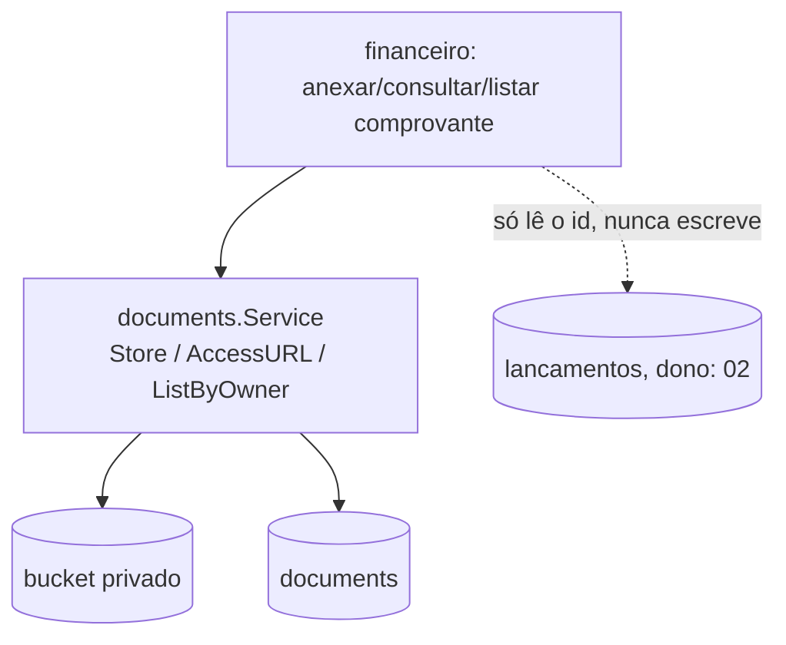

# Comprovantes — Design

**Spec**: `.specs/features/financeiro/spec/04-comprovantes.md`
**Status**: Approved (2026-09-29). Composição pura sobre `platform/documents` — nenhuma entidade, nenhuma tabela nova.

## Architecture Overview

`financeiro` nunca implementa upload, versionamento ou validação de arquivo — isso é `platform/documents`, já concluído e validado (`fundacao-documentos`). O único código novo aqui é a "cola": decidir `owner_type`, `owner_id`, e qual `RequiredPermission` passar em cada chamada.

## Code Reuse Analysis

| Component | Location | How to Use |
|---|---|---|
| Armazenamento, versionamento, URL assinada | `platform/documents.Service` | `Store`, `AccessURL`, `ListByOwner`, chamados diretamente |
| Permissões | `platform/authz` | `financeiro:comprovante:create`/`read`, passadas como `RequiredPermission` — `platform/documents` nunca decide o nome |

## Components

### `financeiro` (camada `comprovantes`)

- **Interfaces**:
  - `AnexarComprovante(ctx, AnexarInput) (documents.Document, error)` — valida que o lançamento existe, então chama `documents.Service.Store`.
  - `ConsultarComprovante(ctx, ConsultarInput) (string, error)` — chama `documents.Service.AccessURL`, devolve a URL.
  - `ListarComprovantes(ctx, ListarInput) ([]documents.Document, error)` — chama `documents.Service.ListByOwner`.
- **Dependencies**: `platform/documents`, e uma leitura simples em `lancamentos` (dono: `02`) só para confirmar que o `id` existe antes de chamar `Store` — mesmo padrão de leitura pontual já usado em `01`/`02` (`FIN-D-008`), nunca escrita.

## Tech Decisions (only non-obvious ones)

| Decision | Choice | Rationale |
|---|---|---|
| Validação de existência do lançamento | Feita aqui, antes de chamar `documents.Service.Store` | `platform/documents` não sabe nada sobre lançamentos — a checagem é responsabilidade do chamador |
| Nenhuma tabela nova | Confirmado | Toda a persistência já existe em `platform/documents` |
