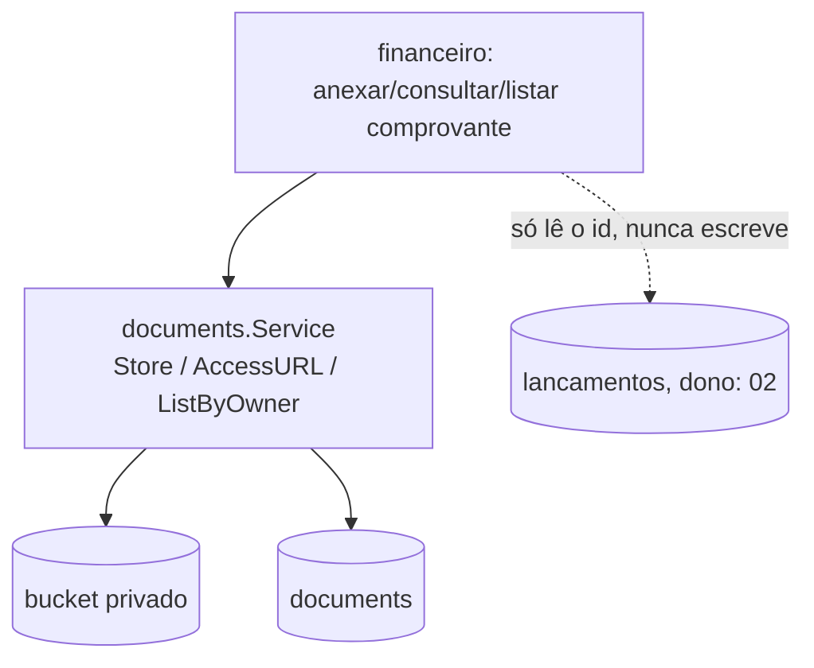

# Comprovantes — Design

**Spec**: `.specs/features/financeiro/spec/04-comprovantes.md`
**Status**: Approved (2026-09-29). Composição pura sobre `platform/documents` — nenhuma entidade, nenhuma tabela nova.

## Architecture Overview

`financeiro` nunca implementa upload, versionamento ou validação de arquivo — isso é `platform/documents`, já concluído e validado (`fundacao-documentos`). O único código novo aqui é a "cola": decidir `owner_type`, `owner_id`, e qual `RequiredPermission` passar em cada chamada.

## Code Reuse Analysis

| Component | Location | How to Use |
|---|---|---|
| Armazenamento, versionamento, URL assinada | `platform/documents.Service` | `Store`, `AccessURL`, `ListByOwner`, chamados diretamente |
| Permissões | `platform/authz` | `financeiro:comprovante:create`/`read`, passadas como `RequiredPermission` — `platform/documents` nunca decide o nome |

## Components

Mesmo módulo Go `financeiro` (`domain/app/infra/http` compartilhados; nenhuma sub-spec vira pacote próprio). Sem entidade nem repositório próprios — composição pura sobre `platform/documents` e uma leitura em `lancamentos` (dono: `02`). Contribui:

- **`app/anexar_comprovante.go`**: `AnexarComprovante(ctx, AnexarInput) (documents.Document, error)` — valida que o lançamento existe (leitura simples via `infra/lancamento_repository.go`, de `02`), então chama `documents.Service.Store`.
- **`app/consultar_comprovante.go`**: `ConsultarComprovante(ctx, ConsultarInput) (string, error)` — chama `documents.Service.AccessURL`, devolve a URL.
- **`app/listar_comprovantes.go`**: `ListarComprovantes(ctx, ListarInput) ([]documents.Document, error)` — chama `documents.Service.ListByOwner`.

## Tech Decisions (only non-obvious ones)

| Decision | Choice | Rationale |
|---|---|---|
| Validação de existência do lançamento | Feita aqui, antes de chamar `documents.Service.Store` | `platform/documents` não sabe nada sobre lançamentos — a checagem é responsabilidade do chamador |
| Nenhuma tabela nova | Confirmado | Toda a persistência já existe em `platform/documents` |
| `Supersedes` | Nunca passado — `AnexarComprovante` sempre chama `Store` com `Supersedes: nil` | `FIN-D-016`: comprovantes são independentes no V1, sem encadeamento de versões |
