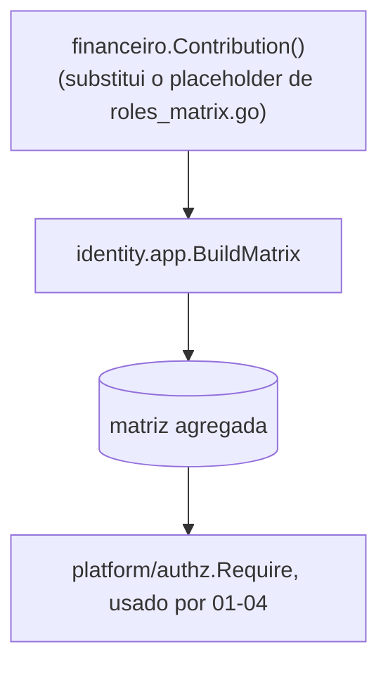

# Permissões — Design

**Spec**: `.specs/features/financeiro/spec/05-permissoes.md`
**Status**: Approved (2026-09-29). Sem entidade nova — é a `Contribution` publicada para `identity.app.BuildMatrix`.

## Architecture Overview

O conteúdo desta `Contribution` é preenchido incrementalmente: cada uma de `01`-`04`, na sua própria fase de tarefas, adiciona as permissões que sua própria operação introduz — nunca antecipadas aqui.

## Code Reuse Analysis

| Component | Location | How to Use |
|---|---|---|
| Agregação da matriz | `identity/app/roles_matrix.go` (`BuildMatrix`, `Contribution`) | `financeiro` publica uma `Contribution` no mesmo formato já usado por `identity` e `audit` |
| Placeholder a substituir | `identity/app/roles_matrix.go:129-141` (`FoundationContributions`) | Removido quando `financeiro.Contribution()` existir; `cmd/api/main.go` e `cmd/bootstrap-admin/main.go` passam a incluir `financeiro.Contribution()` no lugar |

## Components

### `financeiro` (pacote raiz do módulo)

- **Interface**: `func Contribution() app.Contribution` — devolve `Module: "financeiro"`, a lista de `authz.Definition` e o mapa `Grants` por papel.
- **Dependencies**: `identity/app` (só o tipo `Contribution`, já público), `identity/domain` (só os nomes de papel, já públicos) — nenhuma dependência de `identity/domain`/`infra`/`http` além disso.

## Tech Decisions (only non-obvious ones)

| Decision | Choice | Rationale |
|---|---|---|
| Onde a `Contribution` é montada | Uma função no pacote raiz de `financeiro`, mesmo padrão de `identity.New`/`FoundationContributions` | Consistência com o mecanismo já existente |
| Quando o placeholder é removido | Como parte da última tarefa desta spec, depois que `01`-`04` já contribuíram suas permissões | Evita remover o placeholder antes de ter o substituto completo — ver `financeiro/STATE.md`, ordem real de execução |
