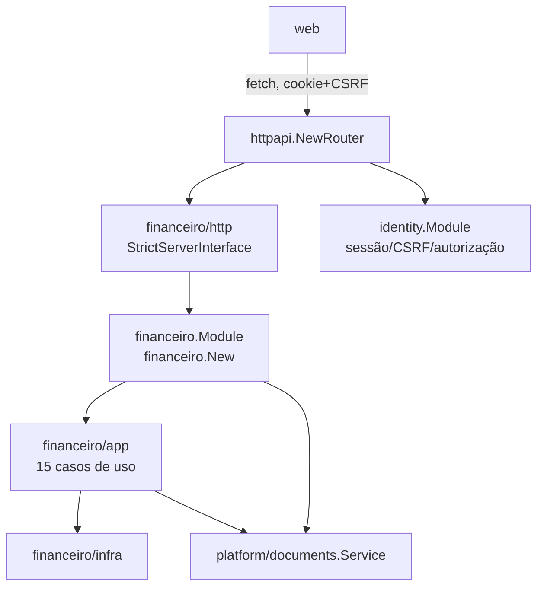

# API HTTP — Design

**Spec**: `.specs/features/financeiro/spec/06-api-http.md`
**Status**: Approved (2026-10-03). Primeira camada de apresentação do módulo `financeiro` — nenhuma entidade nova, nenhum caso de uso novo.

## Architecture Overview



`financeiro/http` espelha exatamente `identity/http`: `StrictServerInterface` gerado por `oapi-codegen`, um `Handler` fino por recurso, erro de domínio mapeado uma única vez. `financeiro.New(...)` é o composition root que falta desde `02/T6` (registrado em `financeiro/STATE.md`, "Estrutura de pacotes") — constrói os 15 casos de uso e os repositórios, sem I/O.

## Code Reuse Analysis

| Component | Location | How to Use |
|---|---|---|
| `problem+json` | `platform/httpx/problem.go` (`WriteProblem`, `BindJSON`) | Reaproveitado sem alteração |
| Autenticação/sessão/CSRF/origem | `platform/httpx/{authn,csrf,middleware}.go` | Já module-agnósticos; `financeiro` entra na mesma chain `authenticated` de `httpapi.NewRouter` |
| `Cents`, `Cursor`, `Limit`, `CursorParam`, `Problem`, `FieldError`, respostas comuns | `api/openapi/common.yaml` | Reaproveitados via `$ref`, nenhum schema novo para esses conceitos |
| Validador de contrato / paridade rota×operação | `httpapi/router.go` (`parity`, `httpx.NewContractValidator`) | `financeiro.yaml` entra na mesma lista de specs validadas |
| `oapi-codegen` (strict, gin-server) | `api/openapi/codegen/identity.yaml` | Novo `api/openapi/codegen/financeiro.yaml`, mesma config, `package: financeirohttp` |
| `storage.NewS3`/`documents.Service` | `platform/storage/s3.go`, `platform/documents/service.go` | Já prontos desde `fundacao-documentos`; nunca antes instanciados em `cmd/api/main.go` |
| `email.Sender` "disabled" | `platform/email/email.go` | Precedente para como tratar uma dependência externa opcional — ver `FIN-D-023` |

## Auditoria dos padrões existentes (confirmados em código, não presumidos)

- **`identity/http`**: `Handler{M, Cookie, Log}`, `New(m, cookie, log)`; `writeError` é o único lugar que converte erro de domínio em HTTP; `sentinels` é uma tabela `[]struct{status int; errs []error}` que usa `sentinel.Error()` como `code` — **só funciona porque os sentinels de `identity/domain` já são escritos em `snake_case`** (`email_taken`, `reason_required`, `privilege_escalation`...). Rotas de transição de estado usam `POST /recurso/{id}/acao` (`deactivate`, `reactivate`, `admin-membership/revoke`, `password-reset`); `PUT` é usado só para substituição completa (`/roles`). Paginação: `limit`/`cursor` em query, `next_cursor` na resposta — usada só por `ListUsers`.
- **`httpapi/router.go`**: compõe `Deps{Ping, Identity, AuditQuery, Log, AllowedOrigins, Cookie}`, monta duas chains (`public`, `authenticated`), registra `identityhttp.Register(...)`, e falha (`panic`) se rotas e operações do contrato não tiverem paridade exata (`AD-012`).
- **OpenAPI**: `common.yaml` não declara rotas, só componentes compartilhados; cada módulo tem seu próprio arquivo com `$ref: 'common.yaml#/...'`; `security: [sessionCookie: []]` no nível do documento, `security: []` só nas rotas públicas (nenhuma de `financeiro`).
- **Web**: `redocly.yaml` lista um `apis.<nome>@v1` por contrato, com `x-openapi-ts.output` apontando para `web/lib/api/<nome>.d.ts`; `pnpm lint:api` roda `redocly lint`, `pnpm gen:api` roda `openapi-typescript` sobre o `redocly.yaml`.
- **Achado real, não presumido**: `platform/documents.Service` e `storage.NewS3` existem e estão prontos desde `fundacao-documentos`, mas **nenhum dos dois é instanciado em `cmd/api/main.go` hoje** — confirmado por busca direta, zero ocorrências de `documents.` nesse arquivo. `config.Load()` já lê as 5 variáveis `S3_*` e `STORAGE_ENABLED` (comentário no código: "DOC-03... nada na API exige isso ainda").
- **Achado real**: `ListarContas` e `ListarLancamentos` não aceitam nenhum parâmetro de filtro, paginação ou ordenação — devolvem a lista inteira, sempre. Confirmado lendo os dois arquivos por completo, não presumido pela semelhança com `ListUsers`.

## Confronto dos 15 casos de uso × operação HTTP

| # | Caso de uso | Permissão | Método | Caminho | Corpo | Paginação | Upload/download |
|---|---|---|---|---|---|---|---|
| 1 | `CriarConta` | `financeiro:conta:create` | `POST` | `/financeiro/contas` | `{tipo, nome, parent_id?}` | — | — |
| 2 | `ListarContas` | `financeiro:conta:read` | `GET` | `/financeiro/contas` | — | nenhuma (lista completa) | — |
| 3 | `DesativarConta` | `financeiro:conta:deactivate` | `POST` | `/financeiro/contas/{id}/deactivate` | — | — | — |
| 4 | `RenomearConta` | `financeiro:conta:update` | `PATCH` | `/financeiro/contas/{id}` | `{nome}` | — | — |
| 5 | `CriarLancamento` | `financeiro:lancamento:create` | `POST` | `/financeiro/lancamentos` | `{tipo, conta_id, valor_bruto_cents, taxa_cents, forma_pagamento}` | — | — |
| 6 | `EditarLancamento` | `financeiro:lancamento:update` | `PUT` | `/financeiro/lancamentos/{id}` | `{conta_id, valor_bruto_cents, taxa_cents, forma_pagamento}` | — | — |
| 7 | `CriarDevolucao` | `financeiro:lancamento:create` | `POST` | `/financeiro/lancamentos/devolucoes` | `{conta_id, valor_bruto_cents, taxa_cents, forma_pagamento, devolucao_de_id}` | — | — |
| 8 | `ListarLancamentos` | `financeiro:lancamento:read` | `GET` | `/financeiro/lancamentos` | — | nenhuma (lista completa) | — |
| 9 | `ReceberLancamento` | `financeiro:lancamento:receive` | `POST` | `/financeiro/lancamentos/{id}/receive` | — | — | — |
| 10 | `PagarLancamento` | `financeiro:lancamento:pay` | `POST` | `/financeiro/lancamentos/{id}/pay` | — | — | — |
| 11 | `CancelarLancamento` | `financeiro:lancamento:cancel` | `POST` | `/financeiro/lancamentos/{id}/cancel` | `{reason}` | — | — |
| 12 | `ConsultarSaldo` | `financeiro:saldo:read` | `GET` | `/financeiro/saldo` | — | — | — |
| 13 | `AnexarComprovante` | `financeiro:comprovante:create` | `POST` | `/financeiro/lancamentos/{id}/comprovantes` | `multipart/form-data` | — | upload |
| 14 | `ConsultarComprovante` | `financeiro:comprovante:read` | `GET` | `/financeiro/comprovantes/{documentId}/url` | — | — | URL assinada |
| 15 | `ListarComprovantes` | `financeiro:comprovante:read` | `GET` | `/financeiro/lancamentos/{id}/comprovantes` | — | nenhuma (lista completa) | — |

Todas as 15 rotas ficam na chain `authenticated` (`AD-013`) — nenhuma pública. `CriarDevolucao` tem endpoint próprio (não um campo opcional de `CriarLancamento`): são structs `Input` Go distintas, casos de uso distintos — a fronteira HTTP espelha a fronteira real do domínio, não presume `1 caso de uso = 1 endpoint` nem funde dois casos de uso num só.

## RBAC — interação com os papéis

Nenhuma permissão nova, nenhuma alteração em `financeiro.Contribution()`/`BuildMatrix`. Tabela de confirmação (valores já publicados, `05-permissoes`):

| Papel | Operações acessíveis |
|---|---|
| `TESOURARIA` | Todas as 15 |
| `DIRETORIA` | `ListarContas`, `ListarLancamentos`, `ConsultarSaldo`, `ConsultarComprovante`, `ListarComprovantes` (as 4 leituras de `financeiro`) |
| `CONSELHO_FISCAL` | Mesmas 4 leituras de `DIRETORIA` — as 3 institucionais (`prestacao_contas`/`parecer`) não têm nenhum caso de uso ainda, `FIN-D-014`, fora do escopo |
| `PRESIDENTE` | Todas as 15, automaticamente, via `BuildMatrix` |
| `ASSOCIADO`, `ESTOQUE_LOJA`, `EVENTOS`, `ADMIN_SISTEMA` | Nenhuma |

A camada HTTP nunca verifica permissão por conta própria: cada handler chama o caso de uso incondicionalmente, e é o `Authz.Require` do caso de uso que recusa (mesmo padrão de delegação já usado por `identity/http` e por `financeiro`'s próprios casos de uso de comprovante, que delegam a `platform/documents`).

## Mapeamento completo de erros (`FIN-D-022`)

```text
domain.ErrContaNaoEncontrada        → 404  conta_nao_encontrada
domain.ErrContaTipoIncompativel     → 422  conta_tipo_incompativel
domain.ErrContaJaUtilizada          → 409  conta_ja_utilizada
domain.ErrContaInvalida             → 422  conta_invalida            (FIN-D-022, confirmado: referência de campo, não recurso da URL)
domain.ErrLancamentoTipoIncompativel→ 422  lancamento_tipo_incompativel
domain.ErrLancamentoNaoEncontrado   → 404  lancamento_nao_encontrado
domain.ErrLancamentoImutavel        → 409  lancamento_imutavel
domain.ErrDevolucaoInvalida         → 422  devolucao_invalida
domain.ErrLancamentoNaoPodeSerRecebido → 409  lancamento_nao_pode_ser_recebido
domain.ErrLancamentoNaoPodeSerPago  → 409  lancamento_nao_pode_ser_pago
domain.ErrLancamentoJaCancelado     → 409  lancamento_ja_cancelado
domain.ErrMotivoObrigatorio         → 422  motivo_obrigatorio
money.ErrOutOfRange                 → 422  amount_out_of_range
authz.ErrForbidden                  → 403  forbidden
documents.ErrExtensionNotAllowed    → 422  document_extension_not_allowed  (code = err.Error(), já snake_case)
documents.ErrTypeNotAllowed         → 422  document_type_not_allowed       (idem)
documents.ErrTypeMismatch           → 422  document_type_mismatch          (idem)
documents.ErrTooLarge               → 413  document_too_large              (idem)
documents.ErrNotFound               → 404  document_not_found              (idem)
documents.ErrOwnerTypeInvalid       → não deveria ocorrer (owner_type é sempre a constante interna); se ocorrer, 500 internal_error — erro de programação, nunca de entrada do cliente
database.Unavailable(err)           → 503  service_unavailable  (já existe em platform/database, reaproveitado)
audit.ErrWrite                      → 500  audit_failed          (já existe, reaproveitado)
default                             → 500  internal_error
```

`type` é sempre `"about:blank"` e `title` é sempre `http.StatusText(status)` — nenhuma variação por erro, já fixados por `httpx.WriteProblem`. Cada "→" acima define só `status`+`code`; `detail` é uma frase curta em português, escolhida na implementação, sem significado para o cliente além de leitura humana (igual ao padrão de `identity/http`).

**Por que `financeiro` não pode reaproveitar `sentinel.Error()` como `identity` faz**: os sentinels de `identity/domain` já são `snake_case` (`email_taken`, `privilege_escalation`); os de `financeiro/domain` são frases em português (`"conta não encontrada"`, `"lançamento não pode ser recebido"`) — usá-los direto como `code` produziria um código instável, não-ASCII, que o `common.yaml` descreve como devendo ser "estável". A tabela acima é uma tradução explícita, escrita à mão na tabela de mapeamento de `financeiro/http`, nunca derivada de `.Error()`. Isso não é uma falha de `01`-`05`: aqueles sentinels foram escritos para log/erro interno em português, nunca para serem código de API — ninguém previu HTTP até agora.

## Estratégia de comprovantes

- **Anexar**: `multipart/form-data`, campo `file`. Handler lê o `multipart.File`, repassa como `io.Reader` para `AnexarComprovante.Execute` — nenhuma validação de extensão/tipo/tamanho na camada HTTP, tudo delegado a `platform/documents` (`FIN-D-016`, já decidido).
- **Consultar**: `GET /financeiro/comprovantes/{documentId}/url` responde `{url}` com `Cache-Control: no-store` (mesmo padrão de `ResetUserPassword200ResponseHeaders`, um segredo de validade limitada, nunca cacheado).
- **Listar**: `GET /financeiro/lancamentos/{id}/comprovantes`, resposta uma lista simples (sem paginação — `ListarComprovantes` não suporta), cada item com os metadados que `documents.Document` já expõe (id, nome original, tipo de conteúdo, tamanho, versão, enviado em/por).
- Nenhum erro de `platform/documents` é reimplementado ou traduzido para um novo significado — ver tabela de erros.

### Limite de corpo (`FIN-D-024`)

`platform/httpx.BodyLimit(limit)` já é parametrizável; a chain `authenticated` hoje aplica `AuthenticatedBodyLimit = 1 MiB` globalmente — insuficiente para o limite de 10 MiB de `platform/documents` (`DOC-01 AC3`). A rota de anexar comprovante precisa de uma chain própria (`authenticatedUpload`), com um limite maior, acomodando o overhead de `multipart/form-data` acima dos 10 MiB do arquivo em si. **Aprovado: 11 MiB** (10 MiB + ~1 MiB de margem para cabeçalhos multipart e metadados do formulário, `FIN-D-024`) — `platform/documents.maxSize` permanece `10 MiB`, inalterado.

## Composition root (`financeiro.New`)

Mesmo template de `identity.New`/`identity.Module` (`internal/identity/module.go`), sem nenhum desvio:

```text
financeiro.Deps{
    DB         *gorm.DB
    Recorder   *audit.Recorder
    Authorizer *authz.Authorizer
    Documents  *documents.Service   // já composto por cmd/api/main.go, injetado, não criado por financeiro
    Now        func() time.Time     // default ao relógio real
}

financeiro.Module{
    Contas       *infra.ContaRepository
    Lancamentos  *infra.LancamentoRepository

    CriarConta           *app.CriarConta
    ListarContas         *app.ListarContas
    DesativarConta       *app.DesativarConta
    RenomearConta         *app.RenomearConta
    CriarLancamento       *app.CriarLancamento
    EditarLancamento      *app.EditarLancamento
    CriarDevolucao        *app.CriarDevolucao
    ListarLancamentos     *app.ListarLancamentos
    ReceberLancamento     *app.ReceberLancamento
    PagarLancamento       *app.PagarLancamento
    CancelarLancamento    *app.CancelarLancamento
    ConsultarSaldo        *app.ConsultarSaldo
    AnexarComprovante     *app.AnexarComprovante
    ConsultarComprovante  *app.ConsultarComprovante
    ListarComprovantes    *app.ListarComprovantes
}

func New(d Deps) *Module   // monta tudo, nenhum I/O
```

`financeiro.Contribution()` (já existente, `05-permissoes`) não muda — continua no mesmo `module.go`, função separada de `New`.

### Wiring em `cmd/api/main.go`

```text
1. storage.NewS3(ctx, storage.Config{...cfg.S3*})       // já existe, nunca chamado
2. documents := &documents.Service{DB, Storage, Authz: authorizer, Audit: recorder, URLTTL: ...}
3. fin := financeiro.New(financeiro.Deps{DB, Recorder: recorder, Authorizer: authorizer, Documents: documents})
4. Deps.Financeiro = fin  (novo campo em httpapi.Deps)
```

**`FIN-D-023` — comportamento quando `STORAGE_ENABLED=false`**: como `AD-012` exige que toda rota do contrato tenha operação registrada incondicionalmente, as rotas de comprovante não podem ser condicionalmente registradas. Resolução: `cmd/api/main.go` falha ao iniciar (mesmo padrão de outras validações obrigatórias de `config.Load()`) se `financeiro` for composto sem `STORAGE_ENABLED=true` — não um `503` por requisição. Diferente do precedente de `email.Sender` "disabled" (que tem um `disabledSender` que sempre funciona, porque e-mail é opcional para o sistema inteiro): armazenamento de comprovantes não é opcional depois que `financeiro` expõe HTTP, porque a rota sempre existe no contrato.

### `httpapi/router.go`

Adiciona `Deps.Financeiro *financeiro.Module`; constrói `financeirohttp.New(d.Financeiro, d.Log)`; adiciona `financeirohttp.GetSpec()` à lista de specs validadas; registra `financeirohttp.Register(r, handler, handler, httpapi.Chains{...})` com as mesmas chains `authenticated` (mais a chain dedicada de upload, só para a rota de anexar comprovante); a verificação de paridade rota×contrato (`parity`) passa a cobrir `financeiro.yaml` automaticamente, sem nenhuma mudança na função `parity` em si.

## Web (só o que será gerado, nenhuma implementação)

- `redocly.yaml`: nova entrada `financeiro@v1: {root: ../api/openapi/financeiro.yaml, x-openapi-ts: {output: ./lib/api/financeiro.d.ts}}`.
- `pnpm lint:api` passa a validar `financeiro.yaml` também.
- `pnpm gen:api` gera `web/lib/api/financeiro.d.ts` — tipos TypeScript dos 15 paths/operations e seus schemas, no mesmo formato de `identity.d.ts`/`platform.d.ts`.
- Nenhum componente, hook ou tela é criado nesta rodada.

## Tech Decisions (only non-obvious ones)

| Decision | Choice | Rationale |
|---|---|---|
| `CriarDevolucao` como endpoint próprio | `POST /financeiro/lancamentos/devolucoes` | Espelha a fronteira real do domínio (casos de uso distintos), não presume fusão |
| Tabela de erros explícita, não `sentinel.Error()` | Tradução manual, `FIN-D-022` | Sentinels de `financeiro` são frases em português, não códigos — diferente de `identity` |
| Paginação/filtro/ordenação | Fora do escopo, `FIN-D-021` | Casos de uso não suportam; estendê-los é mudança de código existente, fora desta rodada |
| Falha no startup sem `STORAGE_ENABLED` | `FIN-D-023` | `AD-012` exige paridade incondicional rota×contrato |
| Chain de upload dedicada | `FIN-D-024`, valor proposto 11 MiB | `BodyLimit` já parametrizável; só o valor exato é aberto |
