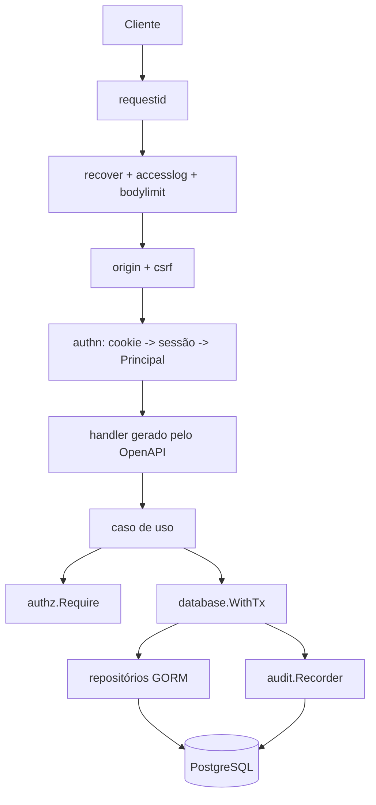
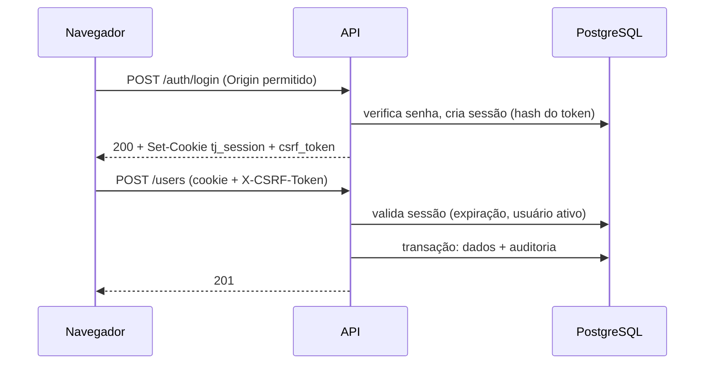

# Fundação Design

**Spec**: `.specs/features/fundacao-core/spec.md`
**Status**: Approved (2026-09-26), com os ajustes do mantenedor. Feature 1 de 2; a outra é `fundacao-documentos`.

Decisões ativas do projeto respeitadas: AD-001 a AD-009 (`.specs/STATE.md`). Nenhuma é substituída por este design.

---

## Abordagens avaliadas

| Tema | Abordagem recomendada | Alternativas | Por que |
|---|---|---|---|
| Autenticação e autorização | Implementação mínima própria em `identity` e `platform/authz` (sessões e permissões em tabelas) | Casbin para políticas; provedor externo de identidade (Ory Kratos, Keycloak) | O ADR-005 fixa sessão própria e adia provedor externo. As regras aqui são um mapa papel-permissão simples, pequeno demais para justificar um motor de políticas e sua DSL |
| Transação e auditoria | Unidade de trabalho: a transação viaja no `context`, e o registrador de auditoria exige essa transação | Repositórios recebendo `*gorm.DB` explícito; triggers de auditoria no banco | Garante a auditoria na mesma transação (ADR-004) sem passar `tx` por toda assinatura; falha alto se esquecerem a transação. Triggers perdem o contexto de negócio |
| Contrato de API | Spec-first e contract-first: um contrato OpenAPI por módulo em `api/openapi/` gera servidor e tipos TypeScript, ambos versionados | Code-first com anotações; sem contrato | O contrato revisado no PR impede divergência entre servidor e front; a geração versionada deixa a mudança visível |

Aprovando este design, essas escolhas ficam confirmadas.

---

## Architecture Overview

Uma requisição atravessa uma cadeia de middlewares e chega ao caso de uso, que verifica a permissão, abre uma transação e grava dados e auditoria juntos.



Sessão e CSRF:



Regras de desenho:

- O middleware `authn` só autentica e coloca o `Principal` no contexto. **A permissão é verificada no caso de uso** (`authz.Require`), nunca só na rota (regra 6 de `domain-boundaries.md`).
- Rotas são negadas por padrão: só a lista pública (`/healthz`, `POST /api/v1/auth/login`) dispensa sessão, e um teste percorre o router para garantir isso.
- A sessão é validada a cada requisição. A atualização de `last_seen_at` ocorre no máximo uma vez por minuto para limitar escritas.
- O `Principal` (papéis e permissões efetivas) é lido do banco a cada requisição, sem cache, para que mudança de papel valha na requisição seguinte.

---

## Code Reuse Analysis

### Existing Components to Leverage

| Component | Location | How to Use |
|---|---|---|
| Carregamento de config | `api/internal/config/config.go` | Estender com os novos campos, mantendo `Load()` |
| Conexão GORM e ping | `api/internal/database/database.go` | Estender `Open` com logger parametrizado; manter `Ping` |
| Router e `/healthz` | `api/internal/httpapi/router.go` | Trocar `gin.Logger` pelo middleware próprio; manter o handler de saúde |
| Migrações | `api/migrations/000001_init.up.sql` | Reusa `pgcrypto` (`gen_random_uuid()`); novas migrações seguem a numeração |
| Compose e `.env.example` | `docker-compose.yml`, `.env.example` | Separar papéis dono e aplicação |
| CI `api` e `web` | `.github/workflows/ci.yml` | Acrescentar testes de integração, `pnpm test` e checagens de OpenAPI |
| Utilitários de versão | `.github/scripts/` | Nenhum reaproveitamento necessário |

### Integration Points

| System | Integration Method |
|---|---|
| PostgreSQL | GORM com papel de aplicação (`tj_app`); migrações com `golang-migrate` e papel dono (`tj_owner`) |
| Front (`web/`) | Tipos TypeScript gerados de `api/openapi/*.yaml` em `web/lib/api/<modulo>.d.ts`; formatador de dinheiro em `web/lib/money.ts` |

---

## Components

### platform/config (estende o existente)

- **Purpose**: Ler e validar todas as variáveis de ambiente na partida.
- **Location**: `api/internal/config/`
- **Interfaces**: `Load() (Config, error)`, erro nomeando a variável inválida, sem imprimir segredos.
- **Dependencies**: nenhuma.
- **Reuses**: `config.Load` atual.

### platform/logx

- **Purpose**: Logger `slog` em JSON com redação de chaves sensíveis.
- **Location**: `api/internal/platform/logx/`
- **Interfaces**: `New(level string, w io.Writer) *slog.Logger`.
- **Dependencies**: biblioteca padrão.

### platform/httpx

- **Purpose**: Middlewares e utilitários HTTP compartilhados.
- **Location**: `api/internal/platform/httpx/`
- **Interfaces**:
  - `RequestID() gin.HandlerFunc`
  - `Recover(*slog.Logger) gin.HandlerFunc`, `AccessLog(*slog.Logger) gin.HandlerFunc`, `BodyLimit(int64) gin.HandlerFunc`
  - `WriteProblem(c *gin.Context, status int, code, detail string, errs ...FieldError)`
  - `Authn(SessionValidator) gin.HandlerFunc`, `CSRF(allowedOrigins []string) gin.HandlerFunc`
- **Dependencies**: `logx`, `identity` (via interface `SessionValidator`, definida em `httpx` para não importar o módulo).
- **Reuses**: `gin` já em uso.

### platform/database

- **Purpose**: Conexão, migrações e unidade de trabalho.
- **Location**: `api/internal/platform/database/` (o pacote atual `internal/database` é movido para cá)
- **Interfaces**:
  - `Open(dsn string, log *slog.Logger) (*gorm.DB, error)`, `Ping(db) func(ctx) error`
  - `Migrate(ownerDSN, dir string) error`
  - `WithTx(ctx, db, fn func(ctx context.Context) error) error` e `TxFrom(ctx) (*gorm.DB, bool)`
- **Dependencies**: `golang-migrate` (biblioteca), GORM.

### platform/money

- **Purpose**: Dinheiro em centavos: aritmética, formatação, JSON, rateio e percentual.
- **Location**: `api/internal/platform/money/`
- **Interfaces**: `type Cents int64`; `Add`, `Sub`, `Cmp`; `Format`, `Parse`; `MarshalJSON`, `UnmarshalJSON`; `Allocate(total Cents, weights []int64) ([]Cents, error)`; `Percent(a Cents, bp int64) (Cents, error)`; `ErrOverflow`.
- **Dependencies**: `math/big` ou `math/bits` para o produto intermediário.
- **Escopo (confirmado em 2026-09-26)**: núcleo monetário compartilhado, tratado como infraestrutura. Conhece apenas valores em centavos e operações sobre eles. **Não** contém lançamentos financeiros, receitas, despesas, plano de contas, produtos, eventos, taxas de meio de pagamento nem qualquer conceito de módulo de negócio; esses pertencem aos módulos de domínio posteriores, que importam `platform/money`. O mesmo vale para `web/lib/money.ts`.

### platform/audit

- **Purpose**: Gravar e consultar o registro imutável.
- **Location**: `api/internal/platform/audit/`
- **Interfaces**:
  - `Recorder.Record(ctx context.Context, e Entry) error`
  - `Query.List(ctx, f Filter, cursor string, limit int) (Page, error)`
- **Dependencies**: `database.TxFrom`, `authz.Principal`, `httpx` (request id via contexto).

### platform/authz

- **Purpose**: Permissões, principal e verificação.
- **Location**: `api/internal/platform/authz/`
- **Interfaces**: `type Permission string`; `ParsePermission(string) (Permission, error)`; `Principal{UserID, Roles []string, Permissions map[Permission]struct{}}`; `Require(p Principal, perm Permission) error`.
- **Dependencies**: nenhuma.

### platform/password

- **Purpose**: Hash e verificação com argon2id, e lista embutida de senhas comuns ou comprometidas.
- **Location**: `api/internal/platform/password/`
- **Interfaces**: `Hash(plain string, p Params) (string, error)`, `Verify(plain, hash string) (bool, error)`, `Denylist.Contains(plain string) bool` (comparação sem diferenciar maiúsculas; lista via `go:embed`).
- **Dependencies**: `golang.org/x/crypto/argon2`; arquivo da lista, com fonte e licença verificadas na tarefa.

### identity

- **Purpose**: Usuários, papéis, sessões e casos de uso de acesso.
- **Location**: `api/internal/identity/{domain,app,infra,http}/`
- **Interfaces**: política de senha por papel no domínio (mínimo 10 para qualquer papel diferente de ASSOCIADO, 8 só para ASSOCIADO, máximo 128 pontos de código); casos de uso `Authenticate`, `Logout`, `CreateUser`, `DeactivateUser`, `ChangePassword`, `AssignRoles`, `ListUsers`, `SyncRoles`; `SessionValidator.Validate(ctx, token) (authz.Principal, csrf string, error)`.
- **Dependencies**: `platform/*`.

### cmd/bootstrap-admin e cmd/api

- **Purpose**: CLI do primeiro ADMIN e ponto de entrada com a fiação (config, logger, sincronização de papéis, router).
- **Location**: `api/cmd/bootstrap-admin/`, `api/cmd/api/`

### web/lib/money.ts e web/lib/api

- **Purpose**: Formatador de dinheiro e tipos gerados do contrato.
- **Location**: `web/lib/money.ts`, `web/lib/api/<modulo>.d.ts`

---

## Contrato OpenAPI (contract-first)

Aprovado em 2026-09-26 (ADR-008 e AD-010). O contrato é a fonte de verdade da comunicação entre API e front.

```
api/openapi/
  common.yaml      componentes compartilhados: Problem, Cents, Limit, Cursor, segurança (cookie e X-CSRF-Token)
  platform.yaml    /healthz e /api/v1/audit-logs
  identity.yaml    /api/v1/auth/*, /api/v1/users, /api/v1/roles
  (financeiro.yaml, estoque.yaml, loja.yaml, associados.yaml, eventos.yaml: nas features de cada módulo)
api/openapi/codegen/<modulo>.yaml       configuração do oapi-codegen por módulo
api/internal/platform/api/              código gerado do platform (pacote platformapi)
api/internal/identity/http/             código gerado do identity (pacote identityhttp)
web/lib/api/<modulo>.d.ts               tipos TypeScript gerados por módulo
```

**Fluxo:** Contrato, Lint, Generate, Implement, Validate.

1. Edita-se o contrato do módulo em `api/openapi/`; a mudança aparece no PR.
2. `pnpm lint:api` (Redocly) precisa passar.
3. `go generate` regenera interfaces e modelos do módulo (`go tool oapi-codegen`); `pnpm gen:api` regenera os tipos TypeScript. Ambos versionados.
4. O handler implementa a interface strict gerada: divergência entre contrato e código não compila.
5. Testes de integração validam a resposta real contra o contrato do módulo (`kin-openapi`, `ValidateResponse`), e um teste garante que toda rota do Gin existe em algum contrato.
6. O job de CI `contract` (Go e Node) regenera tudo e falha se houver diferença com o commitado ou se o lint falhar; ele entra no `ci-gate` e é disparado por mudanças em `api/openapi/**`.

**Ferramentas e versões** (conferidas na documentação vigente em 2026-09-26; fixadas na tarefa T24 depois do teste abaixo): `oapi-codegen` v2.8.0 como `tool` do `go.mod` e `oapi-codegen/runtime` v1.7.0; `kin-openapi` v0.149.0; `openapi-typescript` 7.13.0; `@redocly/cli` 2.54.3. O `openapi-fetch` (0.17.0) entra somente na primeira tela real.

**Regras do contrato:**

- **Limite de responsabilidade:** o OpenAPI define contratos de comunicação (caminhos, esquemas, segurança, exemplos) e **não contém regras de negócio**; elas permanecem nas specs e nos módulos de domínio.
- `Cents` é `integer` `int64` no contrato e mapeia para `money.Cents` (via `x-go-type`), então a validação estrita de JSON do Money vale na API.
- Segurança: cookie de sessão (`apiKey` em cookie) e cabeçalho `X-CSRF-Token` em operações que alteram estado. Erros são `application/problem+json`.

**Teste rápido na tarefa T24 (antes de fixar a solução):** confirmar que o `oapi-codegen` (a) gera corretamente respostas `application/problem+json` no modo strict, (b) trata o esquema de cookie de sessão, (c) trata o parâmetro `X-CSRF-Token` e (d) resolve `$ref` externo para `common.yaml` a partir de contratos de módulos diferentes (mapeamento de imports). Se houver incompatibilidade, a solução volta ao mantenedor antes de ser fixada.

---

## Data Models

Novas migrações (todas com `down`): `000002_audit_log` e `000003_identity`. A `000004_documents` pertence a `fundacao-documentos`. Cada uma concede ao papel `tj_app` apenas o necessário e falha com mensagem clara se o papel não existir.

```sql
-- 000002_audit_log
CREATE TABLE audit_log (
  id            uuid PRIMARY KEY DEFAULT gen_random_uuid(),
  occurred_at   timestamptz NOT NULL DEFAULT now(),
  actor_user_id uuid,
  action        text NOT NULL,
  entity_type   text NOT NULL,
  entity_id     text NOT NULL,
  before        jsonb,
  after         jsonb,
  reason        text,
  request_id    text
);
CREATE INDEX audit_log_entity_idx ON audit_log (entity_type, entity_id, occurred_at DESC);
CREATE INDEX audit_log_time_idx   ON audit_log (occurred_at DESC, id DESC);
-- trigger BEFORE UPDATE OR DELETE (por linha) e BEFORE TRUNCATE (por comando) lançando exceção
-- GRANT INSERT, SELECT ON audit_log TO tj_app  (sem UPDATE, DELETE, TRUNCATE)
```

```sql
-- 000003_identity
CREATE TABLE users (
  id            uuid PRIMARY KEY DEFAULT gen_random_uuid(),
  email         text NOT NULL,
  name          text NOT NULL,
  password_hash text NOT NULL,
  is_active     boolean NOT NULL DEFAULT true,
  must_change_password boolean NOT NULL DEFAULT false,
  created_at    timestamptz NOT NULL DEFAULT now(),
  updated_at    timestamptz NOT NULL DEFAULT now()
);
CREATE UNIQUE INDEX users_email_uq ON users (lower(email));

CREATE TABLE roles (id smallserial PRIMARY KEY, name text NOT NULL UNIQUE, description text NOT NULL);
CREATE TABLE permissions (id serial PRIMARY KEY, name text NOT NULL UNIQUE, is_active boolean NOT NULL DEFAULT true);
CREATE TABLE role_permissions (role_id smallint REFERENCES roles, permission_id int REFERENCES permissions, PRIMARY KEY (role_id, permission_id));
CREATE TABLE user_roles (user_id uuid REFERENCES users, role_id smallint REFERENCES roles, PRIMARY KEY (user_id, role_id));

CREATE TABLE sessions (
  id           uuid PRIMARY KEY DEFAULT gen_random_uuid(),
  user_id      uuid NOT NULL REFERENCES users,
  token_hash   bytea NOT NULL UNIQUE,
  csrf_token   text NOT NULL,
  created_at   timestamptz NOT NULL DEFAULT now(),
  last_seen_at timestamptz NOT NULL DEFAULT now(),
  expires_at   timestamptz NOT NULL,
  revoked_at   timestamptz
);
CREATE INDEX sessions_user_idx ON sessions (user_id) WHERE revoked_at IS NULL;

CREATE TABLE login_attempts (
  id           bigserial PRIMARY KEY,
  email_hash   bytea NOT NULL,
  attempted_at timestamptz NOT NULL DEFAULT now(),
  success      boolean NOT NULL
);
CREATE INDEX login_attempts_idx ON login_attempts (email_hash, attempted_at DESC);
```

**Relationships**: `user_roles` liga usuários e papéis; permissões efetivas são a união via `role_permissions`. `audit_log.actor_user_id` referencia `users` logicamente e não por chave estrangeira, para nunca bloquear a gravação.

**Papéis de banco**: `tj_owner` (migrações e DDL) e `tj_app` (API). `tj_app` tem `SELECT/INSERT/UPDATE/DELETE` nas tabelas de identidade e só `SELECT/INSERT` em `audit_log`. O script `docker/postgres/init/01-roles.sql` cria os papéis no ambiente local, e o helper de testes faz o mesmo.

---

## Error Handling Strategy

| Error Scenario | Handling | User Impact |
|---|---|---|
| Credenciais inválidas ou usuário inativo | 401 `invalid_credentials`, corpo idêntico | Mensagem genérica, sem enumeração de e-mails |
| Sessão ausente, malformada ou expirada | 401 `unauthenticated` ou `session_expired` | Precisa entrar de novo |
| Senha fora da política ou na lista de comprometidas | 422 `password_too_short`, `password_too_long` ou `password_compromised` | Escolher outra senha |
| Troca de senha obrigatória pendente | 403 `password_change_required` em todas as rotas, exceto logout, `me` e troca de senha | Trocar a senha para continuar |
| Permissão insuficiente | 403 `forbidden`, sem revelar existência do recurso | Acesso negado |
| CSRF ou origem inválidos | 403 `csrf_invalid` ou `origin_not_allowed` | Recarregar a página |
| Excesso de tentativas de login | 429 com `Retry-After` | Aguardar 15 minutos |
| JSON malformado ou validação | 400 `invalid_json` ou 422 `validation_failed` com `errors[]` | Corrigir os campos |
| Conflito (e-mail repetido, último ADMIN) | 409 `email_taken` ou `last_admin` | Mensagem específica |
| Falha ao gravar auditoria | Reverte a transação, 500 `audit_failed` | Operação não realizada, sem efeito parcial |
| Banco indisponível | 503 `service_unavailable` | Tentar mais tarde |
| Panic não tratado | 500 `internal_error` com `request_id`, sem detalhes internos | Informar o `request_id` ao suporte |

---

## Risks & Concerns

| Concern | Location (file:line) | Impact | Mitigation |
|---|---|---|---|
| O `gin.Logger` padrão registra o caminho completo com a query string | `api/internal/httpapi/router.go:16` | Vazamento de tokens ou dados em parâmetros de URL | Substituir pelo `AccessLog` próprio, sem query string (PLT-01.3), tarefas T5 e T62 |
| O logger padrão do GORM pode registrar valores de parâmetros (ex.: hash de senha em consulta lenta) | `api/internal/database/database.go:11` | Segredo em log | Logger do GORM com consultas parametrizadas (PLT-01.7), tarefa T6 |
| A API e as migrações usam o mesmo superusuário `tj` | `docker-compose.yml:5` | A aplicação poderia alterar ou apagar auditoria | Dois papéis (`tj_owner`, `tj_app`) e trigger de imutabilidade (AUD-02), tarefas T7 a T9 |
| A `DATABASE_URL` de exemplo usa o superusuário | `.env.example:1` | Convida a rodar a API sem separação de papéis | Exemplo passa a usar `tj_app`, com `MIGRATE_DATABASE_URL` do dono (T9) |
| Cobertura de testes mínima: só `/healthz` e `config` têm testes | `api/internal/httpapi/router_test.go:12` | Regressões silenciosas ao crescer | Infraestrutura de integração e testes 1:1 com os ACs (Phase 2 em diante) |
| O CI não roda testes de integração nem tem Docker configurado para eles | `.github/workflows/ci.yml:103` | Garantias de banco não verificadas | Passo `go test -tags=integration ./...` no job `api` (T13); o `ubuntu-latest` já tem Docker |
| O cookie `SameSite=Lax` (aprovado) só funciona same-site; **a configuração final (domínio do cookie, proxy do Next) depende da estratégia de hospedagem**, ainda não definida | `docs/adr/005-autenticacao-e-rbac.md:30` | O login pode falhar entre domínios distintos em produção | Assumption 1 da spec; `COOKIE_DOMAIN` configurável; validar na feature de UI de identidade e ao decidir a hospedagem |
| Suporte do `oapi-codegen` a `application/problem+json`, cookie de sessão, `X-CSRF-Token` e `$ref` externo entre módulos ainda não foi comprovado | não se aplica (ainda não instalado) | Contrato ou geração incompatíveis com as convenções da API | Teste rápido na tarefa T24 antes de fixar a solução; se falhar, volta ao mantenedor |
| Versões e ferramentas (geradores e linter de OpenAPI, biblioteca de migrações, testcontainers) não foram verificadas na documentação vigente | não se aplica (ainda não instaladas) | Escolher ferramenta descontinuada ou com licença inadequada | Cada tarefa de instalação pesquisa a documentação atual e fixa a versão antes de usar |
| A lista de senhas comprometidas depende de uma fonte externa e de licença compatível | não se aplica (ainda não adicionada) | Lista defasada ou com licença incompatível com um repositório proprietário | A tarefa da lista registra a fonte e a licença; se não houver fonte adequada, gerar uma lista própria de senhas comuns |
| Parâmetros do argon2id podem estar defasados ou pesados para a hospedagem | não se aplica (ainda não implementado) | Segurança fraca ou uso excessivo de memória | Tarefa T41 confere o OWASP vigente e mede o custo |
| Esquecer a transação no caso de uso deixa a auditoria fora dela | não se aplica | Auditoria sem atomicidade | `Recorder` retorna erro sem transação no contexto (AUD-01.6) e há teste de atomicidade (T35) |
| Código gerado versionado gera conflitos de merge | não se aplica | Fricção em PRs | CI recusa diferenças; regenerar é um comando único |

---

## Tech Decisions (only non-obvious ones)

| Decision | Choice | Rationale |
|---|---|---|
| Local e escopo de `money` | `api/internal/platform/money/` e `web/lib/money.ts`, sem conceitos de domínio | É infraestrutura compartilhada como `authz` e `audit`; a dependência vai dos módulos para `platform`, nunca o contrário (verificado por TST-02) |
| Local do pacote de banco | Mover `internal/database` para `internal/platform/database` | Alinha com `domain-boundaries.md`, onde `platform` é o núcleo compartilhado |
| Política de senha | Regra por papel no domínio, mais lista embutida e `must_change_password` | Mínimos diferentes por perfil exigem decidir o que acontece na promoção de um associado a papel administrativo |
| Hash do token de sessão | SHA-256 (não argon2) | O token tem 256 bits aleatórios; hash lento não agrega e custaria a cada requisição |
| Cursor de paginação | Base64 de `(occurred_at, id)` | Estável sob inserções concorrentes, ao contrário de `OFFSET` |
| Permissões declaradas em código | Matriz papel-permissão em Go, sincronizada na partida | Revisável em PR e testável; migrações de dados de permissão seriam difíceis de auditar |
| `audit_log.actor_user_id` sem chave estrangeira | Referência lógica | Evita que uma restrição de FK impeça o registro de auditoria |
| `Principal` sem cache | Consulta por requisição | Mudança de papel vale de imediato; custo aceitável no volume atual |
| Migrações fora da partida da API | Ferramenta `migrate` separada | Cumpre o ADR-002 (nada de `AutoMigrate`) e o papel sem DDL |

> **Decisões de projeto a registrar em `.specs/STATE.md`** (AD-011 a AD-013 na tarefa de guardrails):
> - AD-010 já registrado (contrato OpenAPI contract-first, ADR-008).
> - AD-011: testes de integração atrás da tag `integration`, com PostgreSQL real via testcontainers.
> - AD-012: autorização no caso de uso, rotas negadas por padrão, e papéis de banco separados (dono e aplicação).
> - AD-013: erros em `application/problem+json`, paginação por cursor e identificador de requisição.
