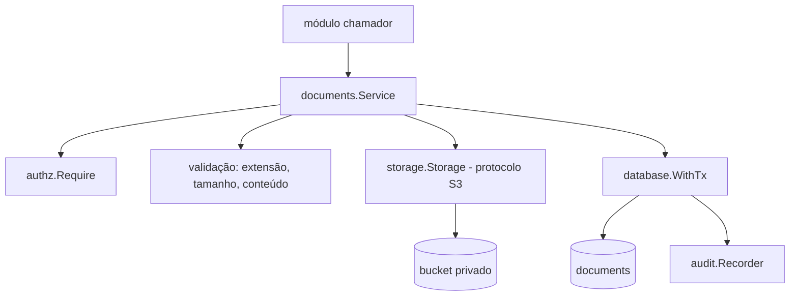

# Fundação Documentos Design

**Spec**: `.specs/features/fundacao-documentos/spec.md`
**Status**: Approved (2026-09-26), com os ajustes do mantenedor. Feature 2 de 2; depende de `fundacao-core` concluída.

Decisões ativas do projeto respeitadas: AD-001 a AD-009, em especial AD-008 (object storage S3, sem provedor definido). Nenhuma é substituída.

---

## Architecture Overview

O serviço de documentos combina permissão, storage e banco. O arquivo vai ao bucket privado por streaming; os metadados e a auditoria entram numa única transação.



Ordem em `Store`: permissão, validação de extensão, leitura em streaming com limite de 10 MiB e detecção do tipo pelo conteúdo, envio ao storage calculando o SHA-256, e então a transação com metadados e auditoria. Se a transação falha, apenas o objeto recém-criado é removido.

---

## Code Reuse Analysis

### Existing Components to Leverage

| Component | Location | How to Use |
|---|---|---|
| Unidade de trabalho e auditoria | `platform/database` e `platform/audit` (da `fundacao-core`) | `WithTx` e `Recorder.Record` na mesma transação |
| Permissões | `platform/authz` | `Require` para `document:file:create` e `document:file:read` |
| Infraestrutura de testes | `platform/testutil` | `NewTestDB` e o helper de contêiner como modelo do emulador S3 |
| Configuração | `api/internal/config/config.go` | Novos campos de S3 e de validade da URL |

### Integration Points

| System | Integration Method |
|---|---|
| Object storage S3 | Cliente S3 atrás da interface `storage.Storage`, endpoint configurável e estilo de path opcional; SDK a confirmar na tarefa T4 |
| PostgreSQL | Migração `000004_documents`, com `tj_app` sem UPDATE e DELETE |

---

## Components

### platform/storage

- **Purpose**: Interface mínima para object storage S3, sem provedor definido.
- **Location**: `api/internal/platform/storage/`
- **Interfaces**: `Put(ctx, key string, r io.Reader, size int64, contentType string) error`; `PresignGet(ctx, key string, ttl time.Duration) (string, error)`; `DeleteCreated(ctx, key string) error` (só para desfazer upload órfão).
- **Dependencies**: SDK S3 (na implementação `s3.go`).

### platform/documents

- **Purpose**: Guardar, versionar e dar acesso a documentos, com permissão e auditoria.
- **Location**: `api/internal/platform/documents/`
- **Interfaces**: `Service.Store(ctx, StoreInput) (Document, error)`; `Service.AccessURL(ctx, id uuid.UUID) (string, error)`.
- **Dependencies**: `storage`, `audit`, `authz`, `database`.

---

## Data Models

Migração `000004_documents` (com `down`, e falha com mensagem clara se o papel `tj_app` não existir).

```sql
-- 000004_documents
CREATE TABLE documents (
  id                uuid PRIMARY KEY DEFAULT gen_random_uuid(),
  owner_type        text NOT NULL,
  owner_id          text NOT NULL,
  original_filename text NOT NULL,
  content_type      text NOT NULL,
  size_bytes        bigint NOT NULL CHECK (size_bytes > 0),
  sha256            char(64) NOT NULL,
  storage_key       text NOT NULL UNIQUE,
  version           int NOT NULL CHECK (version >= 1),
  supersedes_id     uuid UNIQUE REFERENCES documents,
  uploaded_by       uuid NOT NULL REFERENCES users,
  uploaded_at       timestamptz NOT NULL DEFAULT now()
);
CREATE INDEX documents_owner_idx ON documents (owner_type, owner_id);
-- GRANT INSERT, SELECT ON documents TO tj_app (sem UPDATE e DELETE)
```

**Relationships**: `documents.supersedes_id` forma a cadeia de versões, e o `UNIQUE` impede bifurcação. O documento pertence a uma entidade de outro módulo por `owner_type` e `owner_id`, sem chave estrangeira, porque o dono é definido por cada módulo.

---

## Error Handling Strategy

| Error Scenario | Handling | User Impact |
|---|---|---|
| Extensão fora da lista | `document_extension_not_allowed`, antes de ler o conteúdo | Arquivo recusado |
| Tipo divergente da extensão ou fora da lista | `document_type_mismatch` ou `document_type_not_allowed` | Arquivo recusado |
| Arquivo acima de 10 MiB | `document_too_large`, antes de gravar metadados | Arquivo recusado |
| Sem permissão | Erro de proibido, sem escrita e sem URL | Acesso negado |
| Documento inexistente | Erro de não encontrado, sem URL | Não encontrado |
| Falha no upload ao storage | Erro antes de gravar metadados | Nenhum documento registrado |
| Falha ao gravar metadados após upload | Remove só o objeto recém-criado | Nenhum documento registrado, sem órfão |
| Storage inalcançável | Devolve o erro do storage, sem gravar metadados | Tentar mais tarde |

---

## Risks & Concerns

| Concern | Location (file:line) | Impact | Mitigation |
|---|---|---|---|
| SDK S3 e emulador local não foram verificados na documentação vigente | não se aplica (ainda não instalados) | Ferramenta descontinuada ou com licença inadequada | As tarefas T3 e T4 checam documentação, licença e manutenção e registram a fonte antes de fixar versão |
| Objeto enviado e metadados gravados em sistemas diferentes | não se aplica (ainda não implementado) | Objeto órfão se a transação falhar | Remover só o objeto recém-criado e teste de falha simulada (DOC-01.7) |
| Detecção de tipo pelo conteúdo pode ser enganada por arquivos poliglotas | não se aplica | Arquivo malicioso com aparência de imagem | Sem varredura de malware nesta fase (fora de escopo); acesso só por URL assinada curta e permissão |
| URL assinada vaza por compartilhamento do link | não se aplica | Acesso por terceiros durante 300 segundos | Validade curta e auditoria de cada emissão |
| A migração depende do papel `tj_app`, criado fora dela | `docs/architecture/architecture-overview.md` | Falha em ambiente sem o papel | Migração falha com mensagem clara; o script local e o helper de testes criam o papel |

---

## Tech Decisions (only non-obvious ones)

| Decision | Choice | Rationale |
|---|---|---|
| Upload | Pela API, em streaming, sem gravar em disco | Valida tamanho, extensão, conteúdo e permissão antes de persistir |
| Versionamento | Nova linha com `version + 1` e `supersedes_id` | Imutabilidade (ADR-004); o objeto antigo nunca muda |
| Remoção de objeto | Só do objeto recém-criado quando o registro falha | Não viola a proibição de apagar documentos, pois o objeto nunca foi referenciado |
| Chave do objeto | `documents/<uuid>` | Não expõe o nome original e evita colisão |
