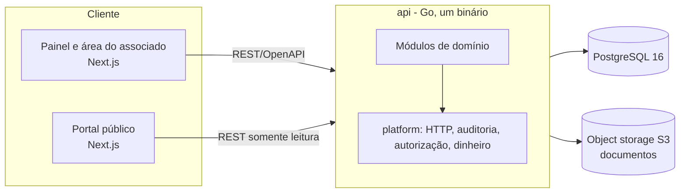

# Visão geral da arquitetura

Estado: proposta aprovada em 2026-09-26. Detalhes das escolhas nos [ADRs](../adr/README.md).

## Contexto

A TJ Platform é a plataforma de gestão institucional da Torcida Jovem do Campo Mourão Futsal. Atende quatro tipos de acesso:

- **Diretoria e administração:** painel autenticado com permissões por papel.
- **Associado:** área autenticada com login próprio (carteira, benefícios, pagamentos, histórico).
- **Visitante público:** portal de transparência, aberto e separado.
- **Sistemas externos:** gateway de pagamento (a definir).

O associado autenticado não é o visitante público: são superfícies distintas, com regras de acesso distintas.

## Visão de alto nível



## Princípios

- **Monólito modular** ([ADR-001](../adr/001-adotar-monolito-modular.md)): um binário, módulos com fronteiras explícitas, transação única por caso de uso.
- **Dinheiro em centavos inteiros** ([ADR-003](../adr/003-valores-monetarios-em-centavos.md)).
- **Auditoria append-only e sem exclusão definitiva** ([ADR-004](../adr/004-auditoria-e-imutabilidade-financeira.md)).
- **Sessão com cookie seguro e RBAC por permissões** ([ADR-005](../adr/005-autenticacao-e-rbac.md)).
- **Migrações versionadas**, sem `AutoMigrate` ([ADR-002](../adr/002-stack-backend-e-frontend.md)).
- **Toda funcionalidade considera** usuários, regras de negócio, permissões, auditoria, histórico e integração entre módulos ([00-CONTEXTO-PROJETO](../00-CONTEXTO-PROJETO.md), seção 7).

## Estrutura do backend

```
api/
  cmd/api/                 ponto de entrada
  internal/
    platform/              núcleo compartilhado: config, http, database, audit, authz, money
    identity/              usuários, papéis, permissões, sessões
    financeiro/  estoque/  loja/  associados/  eventos/  acesso/  transparencia/  comunicacao/
      domain/              entidades e regras
      app/                 casos de uso (transação, permissões, auditoria)
      infra/               repositórios e integrações
      http/                handlers e DTOs
  migrations/              SQL versionado
```

Hoje só existem `cmd/api`, `config`, `database` e `httpapi` (esqueleto). A estrutura acima é o destino, e cada módulo entra por uma spec em [`.specs/`](../../.specs/STATE.md).

## Estrutura do frontend

`web/` usa Next.js (App Router). Áreas separadas por grupo de rotas: painel administrativo autenticado, área do associado autenticada e portal público. O contrato com a API é o OpenAPI, com cliente TypeScript gerado.

## Transversais

| Tema | Onde vive |
|---|---|
| Autenticação e autorização | `identity` (sessões, papéis, permissões); verificação no caso de uso |
| Auditoria | `platform/audit`, gravada na mesma transação |
| Dinheiro | `platform/money` |
| Documentos | Object storage S3 ([ADR-006](../adr/006-armazenamento-de-documentos.md), proposto) |
| Observabilidade | Logs estruturados com identificador de requisição (a detalhar) |

## Implantação

Ambientes `staging` (release em homologação) e `production`, conforme [CONTRIBUTING](../CONTRIBUTING.md). A hospedagem ainda não está decidida.

## Fora do escopo desta fase

Modelagem definitiva do banco, contratos de API, telas, autenticação e integrações.
