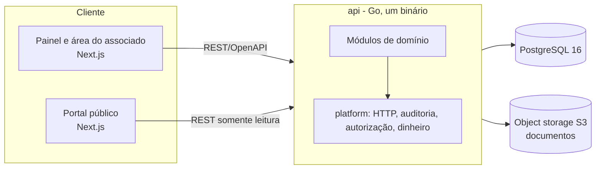

# Visão geral da arquitetura

Estado: aprovada em 2026-09-26 e atualizada após a fundação (2026-09-27). Detalhes das escolhas nos [ADRs](../adr/README.md).

## Contexto

A TJ Platform é a plataforma de gestão institucional da Torcida Jovem do Campo Mourão Futsal. Atende quatro tipos de acesso:

- **Diretoria e administração:** painel autenticado com permissões por papel.
- **Associado:** área autenticada com login próprio (carteira, benefícios, pagamentos, histórico).
- **Visitante público:** portal de transparência, aberto e separado.
- **Sistemas externos:** gateway de pagamento (a definir).

O associado autenticado não é o visitante público: são superfícies distintas, com regras de acesso distintas.

## Visão de alto nível



## Princípios

- **Monólito modular** ([ADR-001](../adr/001-adotar-monolito-modular.md)): um binário, módulos com fronteiras explícitas, transação única por caso de uso.
- **Dinheiro em centavos inteiros** ([ADR-003](../adr/003-valores-monetarios-em-centavos.md)).
- **Auditoria append-only e sem exclusão definitiva** ([ADR-004](../adr/004-auditoria-e-imutabilidade-financeira.md)).
- **Sessão com cookie seguro e RBAC por permissões** ([ADR-005](../adr/005-autenticacao-e-rbac.md)).
- **Migrações versionadas**, sem `AutoMigrate` ([ADR-002](../adr/002-stack-backend-e-frontend.md)).
- **Toda funcionalidade considera** usuários, regras de negócio, permissões, auditoria, histórico e integração entre módulos ([00-CONTEXTO-PROJETO](../00-CONTEXTO-PROJETO.md), seção 7).

## Estrutura do backend

```
api/
  cmd/
    api/                   servidor HTTP: config, composição dos módulos, sincronização de papéis
    bootstrap-admin/       cria o primeiro administrador (senha só por variável de ambiente)
  internal/
    config/                variáveis de ambiente validadas na partida
    httpapi/               router: compõe as cadeias de middleware, os módulos e o contrato
    platform/              núcleo compartilhado, sem regra de negócio
      httpx/               problem+json, request id, log de acesso, limite de corpo, validação do contrato,
                           autenticação por cookie, origem e CSRF
      api/  apicommon/     código gerado do contrato da plataforma e dos componentes comuns
      audit/               registro append-only e consulta de auditoria
      authz/               permissões, autorizador e regra de não escalada de privilégio
      database/            conexão, transação por caso de uso e migrações
      password/ email/     Argon2id e lista de senhas comuns; envio de e-mail atrás de uma interface
      money/ logx/         dinheiro em centavos; log estruturado com redação de campos sensíveis
      testutil/            PostgreSQL de teste (testcontainers) e validação de respostas pelo contrato
    identity/              módulo de identidade (ver abaixo); o pacote raiz compõe o módulo (identity.New)
      domain/  app/  infra/  http/
    financeiro/  estoque/  loja/  associados/  eventos/  acesso/  transparencia/  comunicacao/
                           módulos futuros, cada um com o mesmo esqueleto de pacotes
  openapi/                 um contrato por módulo (platform.yaml, identity.yaml) e common.yaml
  migrations/              SQL versionado, aplicado por tj_owner
```

Só `identity` e o núcleo `platform` existem hoje; os demais módulos entram por spec em [`.specs/`](../../.specs/STATE.md).

### Camadas de um módulo

| Pacote | Responsabilidade | Pode importar |
|---|---|---|
| `domain` | Entidades, regras puras e erros | biblioteca padrão e `platform` |
| `app` | Casos de uso: permissão, transação, auditoria; define as portas (interfaces) | `domain`, `platform` |
| `infra` | Repositórios (GORM e SQL explícito) que implementam as portas | `app`, `domain`, `platform` |
| `http` | Handlers finos sobre a interface gerada do contrato; tabela única de erros de domínio para HTTP | `app`, `domain`, o pacote raiz do módulo, `platform` |

As dependências apontam sempre para dentro (`domain` → `app` → `infra` e `http`). O pacote raiz do módulo (`identity.New`) liga repositórios e casos de uso num só lugar; `httpapi` e os comandos usam o módulo composto.

### `platform` e módulos

`platform` é infraestrutura compartilhada e nunca importa um módulo de negócio; os módulos dependem de `platform`, e de `identity` para autorização. Um módulo só usa o `app` publicado por outro, nunca o `domain`, o `infra` nem o `http` dele. `api/internal/architecture_test.go` verifica essas regras nos imports de produção e descobre os módulos pelos diretórios de `internal/` ([regras completas](domain-boundaries.md), AD-014).

## Contrato OpenAPI

O contrato é a fonte única das rotas (AD-012). Fluxo: editar `api/openapi/*.yaml`, e então gerar as interfaces e os modelos Go (`go generate`, `oapi-codegen` em modo strict) e os tipos do front (`openapi-typescript`), com lint do Redocly. O router valida cada requisição contra o contrato, e a API não inicia se uma rota registrada não tem operação, ou uma operação não tem rota. Os testes validam as respostas contra o mesmo contrato. Comandos em [tooling](../development/tooling.md).

## Cadeia HTTP

| Rotas | Ordem |
|---|---|
| Públicas: `/healthz`, login e as duas de recuperação de acesso | request id, recuperação de panic, log de acesso, origem, limite de corpo (64 KiB), validação do contrato, handler |
| Autenticadas: todas as outras | request id, recuperação de panic, log de acesso, limite de corpo (1 MiB), origem, sessão, CSRF, validação do contrato, handler |

A negação é o padrão (AD-013): fora da lista pública não há acesso sem sessão. A sessão vive no servidor, com cookie `httpOnly`, e a autorização decide por permissões efetivas no caso de uso, nunca pelo nome do papel.

## Banco e papéis

PostgreSQL 16, com migrações do `golang-migrate` aplicadas fora da API.

| Papel | Uso | Pode |
|---|---|---|
| `tj_owner` | Migrações e testes que inspecionam o banco | DDL, dono dos objetos |
| `tj_app` | A API e o `bootstrap-admin` | DML nas tabelas; na auditoria, só `INSERT` e `SELECT` (imutável por gatilhos e grants) |

A API não roda migrações na partida; ao iniciar, apenas sincroniza os papéis e as permissões com o código (idempotente, com auditoria do que mudou).

## Estrutura do frontend

`web/` usa Next.js (App Router). Áreas separadas por grupo de rotas: painel administrativo autenticado, área do associado autenticada e portal público. O contrato com a API é o OpenAPI, com cliente TypeScript gerado.

## Transversais

| Tema | Onde vive |
|---|---|
| Autenticação e autorização | `identity` (sessões, papéis, permissões) e `platform/authz`; verificação no caso de uso |
| Auditoria | `platform/audit`: crítica na mesma transação, eventos de segurança em transação própria; consulta em `GET /api/v1/audit-logs` |
| Dinheiro | `platform/money` |
| Documentos | Object storage S3 ([ADR-006](../adr/006-armazenamento-de-documentos.md), proposto) |
| Observabilidade | Logs JSON com `request_id` e redação de campos sensíveis (`platform/logx`); erros em `application/problem+json` |

## Implantação

Ambientes `staging` (release em homologação) e `production`, conforme [CONTRIBUTING](../CONTRIBUTING.md). A hospedagem ainda não está decidida.

## Fora do escopo da fundação

Modelagem dos módulos de negócio, telas e integrações externas.
