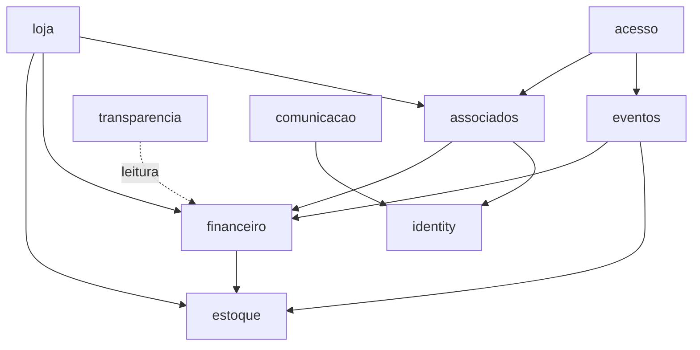

# Fronteiras de domínio

Define o que cada módulo possui e como os módulos se relacionam. Base: [ADR-001](../adr/001-adotar-monolito-modular.md) e [02-MODULOS-SISTEMA](../02-MODULOS-SISTEMA.md).

## Módulos

| Módulo | Responsabilidade | É dono de |
|---|---|---|
| `identity` | Usuários, papéis, permissões e sessões | Contas, credenciais, papéis, permissões |
| `financeiro` | Receitas, despesas, plano de contas, fornecedores, orçamento, saldo, prestação de contas | Lançamentos, categorias, centros de resultado, fornecedores |
| `estoque` | Quantidades de produtos físicos | Movimentações e saldo ([ADR-007](../adr/007-fonte-de-verdade-do-estoque.md), proposto) |
| `loja` | Catálogo, pedidos, vendas e integração de pagamento | Produtos, pedidos, itens |
| `associados` | Programa associativo, planos, categoria, benefícios, carteira digital | Perfil do associado, planos, benefícios |
| `eventos` | Planejamento de ações e resultado financeiro por evento | Eventos, participantes, orçamento do evento |
| `acesso` | Controle de acesso por QR Code, validação e presença | Credenciais de acesso, registros de presença |
| `transparencia` | Portal público com dados agregados | Nenhum dado próprio: projeções somente leitura |
| `comunicacao` | Sugestões, críticas e solicitações | Mensagens e respostas |

`platform` não é um módulo de negócio: é o núcleo compartilhado (configuração, HTTP, banco, auditoria, autorização e dinheiro).

## Dependências permitidas

Todo módulo depende de `platform` e de `identity` para autorização. A seta `financeiro → estoque` existe só para o fluxo de compra (a despesa gera a entrada no estoque). `estoque` não depende de nenhum outro módulo de negócio, o que mantém o grafo sem ciclos; qualquer nova seta precisa preservar isso.

## Regras

1. **Só o dono altera seus dados.** Nenhum módulo escreve nas tabelas de outro.
2. **Comunicação entre módulos por interface publicada** no pacote de aplicação do módulo dono; nunca por acesso direto ao repositório ou às tabelas.
3. **Uma transação por caso de uso**, aberta na camada de aplicação, que cobre as chamadas entre módulos. Não há transação aberta por um módulo dentro de outro.
4. **Sem dependência circular.** Se dois módulos precisam um do outro, extrai-se uma interface ou um evento de domínio em processo.
5. **`transparencia` só lê** projeções agregadas por categoria, sem dados pessoais nem documentos (FIN-001, seção 21).
6. **Autorização por permissão, no caso de uso**, nunca só na rota ([ADR-005](../adr/005-autenticacao-e-rbac.md)).
7. **Toda escrita financeira gera auditoria** ([ADR-004](../adr/004-auditoria-e-imutabilidade-financeira.md)).
8. As regras 1, 2 e 4 devem ser verificadas automaticamente no CI (linter de dependências), a definir na spec de fundação.

## Superfícies de acesso

| Superfície | Autenticação | Módulos expostos |
|---|---|---|
| Painel da diretoria | Sessão, papéis administrativos | Todos, conforme permissões |
| Área do associado | Sessão, papel `ASSOCIADO` | `associados`, `loja` (compras), dados próprios |
| Portal público | Nenhuma | `transparencia` (somente leitura) |

## Pontos a definir em specs

- Permissões exatas de cada papel (matriz por módulo).
- Relação entre "centro de resultado" e "evento" no financeiro.
- Gateway de pagamento e o módulo que o encapsula (`loja`, `associados` ou um adaptador em `platform`).
